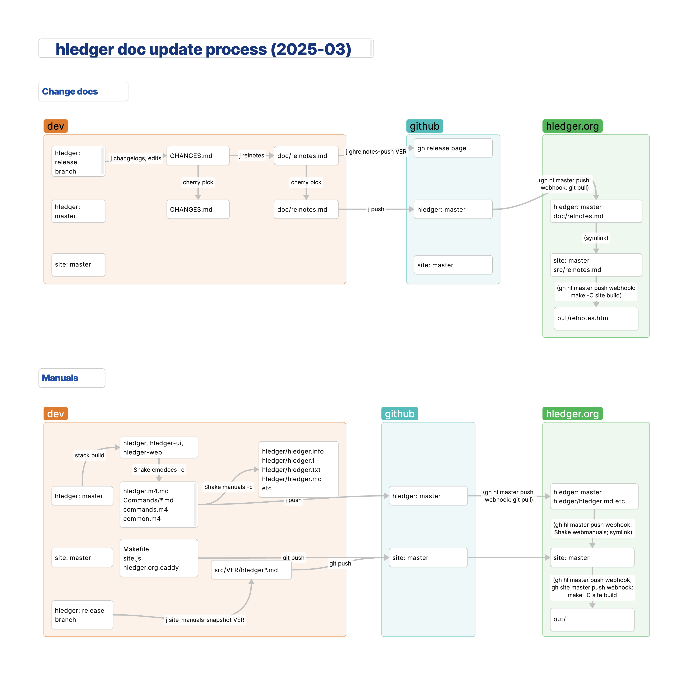

# DOCS

<div class=pagetoc>

<!-- toc -->
</div>

An overview of hledger's documentation structure and maintenance procedures, for developers and maintainers.
(For user documentation, see [Docs](docs.md).
For all developer documentation, see [Developer docs](dev.md).)

## Documentation structure

<div style="margin:1em 2em; font-style:italic;">
"There is a secret that needs to be understood in order to write good
software documentation: there isn’t one thing called documentation,
there are four. They are: tutorials, how-to guides, explanation and
technical reference. They represent four different purposes or
functions, and require four different approaches to their creation."
--[Daniele Procida] (https://news.ycombinator.com/item?id=21289832)
</div>

2019: out of date, needs update.

Project documentation lives in a number of places:

- `site/*.md` is the hledger.org website content, which is generated with hakyll[-std] and pandoc
- haddock documentation in the code appears on Hackage
- short blurbs: cabal files, module headers, HCAR, GSOC project, ..
- `doc/notes.org` has some old developer notes
- developer reports (profiles, benchmarks, coverage..) in doc/profs, sometimes published at hledger.org/profs
- https://github.com/simonmichael/hledger/tree/master/doc


site/ is now a symlink to the separate hledger_site repo.

See also Shake.hs.

hledger doc files can be divided into several groups: 

1. Project admin/dev notes not published on the website.
   These are kept in this directory (doc/). They include: 
   ``` 
   doc/finance/      project finances
   doc/hcar/         Haskell Community and Activities Report entries
   doc/lib.m4        common macros used in package manuals
   doc/manpage.*     misc. templates for rendering package manuals
   doc/mockups/      exploratory developer mockups   
   doc/profs/        a place for long-term profiling/performance data
   ```
2. Project doc files required to be in the top directory:
   ```
   README.md         the main project readme, displayed on github
   LICENSE           the default project license
   ```
3. Code/API docs in haskell source files as haddock comments:
   ```
   hledger*/**/*.hs  haddock module and function docs in most source files
   ```
4. Per-package descriptions, readmes, changelogs, and reference manuals.
   These are in the respective package directories:
   ```
   hledger*/package.yaml    source for package metadata (description, etc.)
   hledger*/README          package readme, displayed on hackage
   hledger*/CHANGES         package changelog, displayed on hackage
   hledger*/hledger*.m4.md  package manual source file(s)
   ```
5. The project website and additional docs - home page, FAQ, tutorials, 
   how-tos, developer guide, etc. These are in the site directory:
   ```
   site/             hledger.org website content, templates, assets
   ```

## Workflows

Last updated: 2025-09
<!-- keep synced with Justfile, Shake.hs -->

### Compile the Shake script

`Shake.hs` automates some doc maintenance tasks (complementing `Justfile)`.
Most contributors don't need to use it, but if you do, compile it like so:
in the hledger repo, run:
```
$ ./Shake.hs
```

### Update options help

Edit general options definitions in `hledger/Hledger/Cli/CliOptions.hs`
and  command options definitions in `hledger/Hledger/Cli/Commands/*.hs`.

### Update manuals' content

Updates and fixes for the manuals' content are welcome and encouraged!
They can be committed together with related code changes, or separately.

The manuals have (a) source files, kept in the hledger repo and (b) generated files derived from those.
Don't edit the generated files, such as:
- `hledger/hledger.md` or `hledger-ui/hledger-ui.md` in the hledger repo
- `site/src/1.50/hledger*.md` or `site/src/dev/hledger*.md` in the hledger_site repo

Instead, edit the source files:
- `hledger/hledger.m4.md` or `hledger/Hledger/Cli/Commands/*.md` for the hledger manual
- `hledger-ui/hledger-ui.m4.md` for the hledger-ui manual
- `hledger-web/hledger-web.m4.md` for the hledger-web manual.

(There are a few more source files which change less often;
if you click "edit this page" on a recent release manual on the website, you'll see all source files listed.)

### Update manuals' generated files

Contributors don't need to do this; usually it's done periodically by the maintainer.
It requires unix tools such as m4, makeinfo and pandoc.

In the hledger repo: first, set current year and month for the man pages:
```
$ just mandates
```

Then update the lists of command line options in the manuals' source files (only as needed, if command line options or option help have changed):
```
$ stack build && ./Shake cmddocs -c
```

Then regenerate the text, man, info, and markdown manuals in hledger*/ from their source files:

```
$ ./Shake manuals -c
```

### Update dev manuals on the website

When updates to manuals' generated files land in the master branch of the hledger repo on github,
the dev manuals on hledger.org will update automatically.

(The manuals on the website are rendered from `site/src/VERSION/*.md` in the hledger_site repo,
which are symlinked copies of `hledger/hledger.md`, `hledger-ui/hledger-ui.md` and `hledger-web/hledger-web.md` in the hledger repo.)

### Update release manuals on the website

Contributors can do this, but doing it the right way is a little complicated; you can also ask the maintainer to do it.

The release manuals on the website are rendered from `site/src/1.50/*.md`, `site/src/1.43/*.md`, etc.
These are generated as follows:

In the hledger repo, with the hledger_site repo symlinked as `./site`;\
for each major release REL that needs updating:

1. Cherry pick the manuals' content updates for REL (not generated files updates) from `master` to `REL-branch`
2. In master, run `just site-manuals-snapshot REL` to update the release manuals in the site repo.

When these commits land in the hledger_site repo on github,
the release manuals on hledger.org will update automatically.

### Add new release manuals to the website

A few extra steps are needed the first time new release's manuals are added to the site,
to update redirects and the version links shown at the top of manuals:

1. In the site repo, update and push version numbers in Makefile, site.js, hledger.org.caddy
2. On hledger.org, restart the web server
3. On cloudflare, purge hledger.org/site.js from the cache

### Update hledger binaries with latest docs

This ensures the hledger dev executables are embedding the latest manuals' generated files, affecting:
- options help displayed by `--help`
- command docs displayed by `CMD --help`
- manuals displayed by `help`, `--info`, and `--man`.

Update the options help, manuals' content and manuals' generated files as above, then rebuild:
```
$ stack build
```

### Update change logs

Changelogs are in `**/CHANGES.md` (one in each package, and one at top level for the project).
They should ideally be updated continually (at least weekly), in master, taking advantage of fresh memory and context.
At release time they get some extra polish, and are propagated to the release branch.
Note once the release branch is created, extra care is needed to keep the changelogs in sync:
- sync change notes corresponding to any code changes synced between master and release branch
- sync change note updates between both branches.

To update changelogs, in master or in a release branch:

1. Add new draft change notes to all changelogs (based on commit messages since the release or commit id mentioned in their first heading):
   ```
   $ just changelogs
   ```
2. Edit and polish the new change notes.
3. Add issue number links, eg with `md-issue-refs` macro.
4. Commit, eg with `just changelogs -c`

### Finalise change logs for a release

In the release branch, on the day of release, run this to add release headings and commit:
```
$ just changelogs-finalise
```

### Update release notes

Release notes are in `doc/relnotes.md` in the hledger repo (and symlinked as `site/src/relnotes.md` in the site repo).
They are generated at release time, from the finalised change logs.
Note once the release notes are generated, they should be kept in sync with any late updates to the changelogs (by regenerating them).

To update release notes:

1. In the release branch, with change logs finalised, run
   ```
   $ just relnotes
   ```
2. Review the new release notes. Add a summary of changes at the top.

### Update release notes on github

Release notes are uploaded to each github release, with some additional github-specific release docs.

In the release branch, once the corresponding github release is created, after updating release notes:

1. If needed, update github release docs in `doc/ghrelnotes`.
2. Push this and the latest release notes to the github release:
   ```
   $ just ghrel-notes
   ```

### Update release notes on the website

1. Cherry pick the latest release notes (`doc/relnotes.md`) from the release branch to master.
2. Push to the master branch on github. The website's "Release notes" page will update automatically.

### Diagrams

(approximate)
[](doc-update.png)


## 201901 docs reorg (#920, WIP)

https://groups.google.com/forum/#!topic/hledger/t2nVr3zER8Q/discussion

> > On Oct 26, 2018, at 1:47 PM, Simon Michael <simon@joyful.com> wrote:
> >
> > A quick heads-up: I am feeling like stepping back from github wiki, and reorganising our docs like so:
> >
> > Two repos:
> >
> > 1. hledger - code and hard docs
> >
> >   - code and code docs (haddock docs & doctest examples)
> >   - developer docs (READMEs in md or org format)
> >   - product manuals (hledger*/hledger*.m4.md)
> >   - release notes and announcements
> >   - HCAR entries
> >
> > 2. hledger-site - website and soft docs
> >
> >   - hledger.org content, resources, site infrastructure
> >   - user cookbook, how-tos, articles
> >   - links to blog posts, discussions etc.
> >   - other resources relating to our web presence/marketing
> >
> > If you disagree, let's discuss. Some quick considerations:
> >
> > - moving docs to the wiki hasn't affected the contribution rate
> > - using the wiki increases our dependence on github and makes our work less self-contained and future-proof
> > - the wiki docs don't look great, aren't very flexible, & don't integrate well with our site & static docs
> > - using two docs systems increases complexity
> > - dev docs in the wiki are too far from the code, and compete with READMEs
> 
> PS:
> 
> - Why not go back to just one repo for everything ? Or if two repos, why not put all docs in one of them ? 
> 
> Dev docs are most discoverable and maintainable right there in the main repo, ie as READMEs. Likewise for API docs (haddocks) and the reference manuals (hledger*/hledger*m4.md). We want all of these updated in lock step with code/tooling changes.
> 
> Other ("soft") docs are needed, but these have a more relaxed process, schedule, and scope (eg bookkeeping advice). They occasionally generate a lot of noise in the commit log, and I think it's a good to keep that out of the code history. The website (home and other pages, site design, site infrastructure) generates similar commit storms and is somewhat independent of code, so it goes in the soft docs repo too.
> 
> These are my thoughts, but I have an open mind if you see a better way.
> 
> 	me (Simon Michael (sm) change) 	
> 10/27/18
> Still plenty of time to discuss and reconsider, but see also
> https://github.com/simonmichael/hledger/issues/920
> https://github.com/simonmichael/hledger/issues/921
> 
> I'll probably make a start on the first one (consolidating dev docs in main repo).
