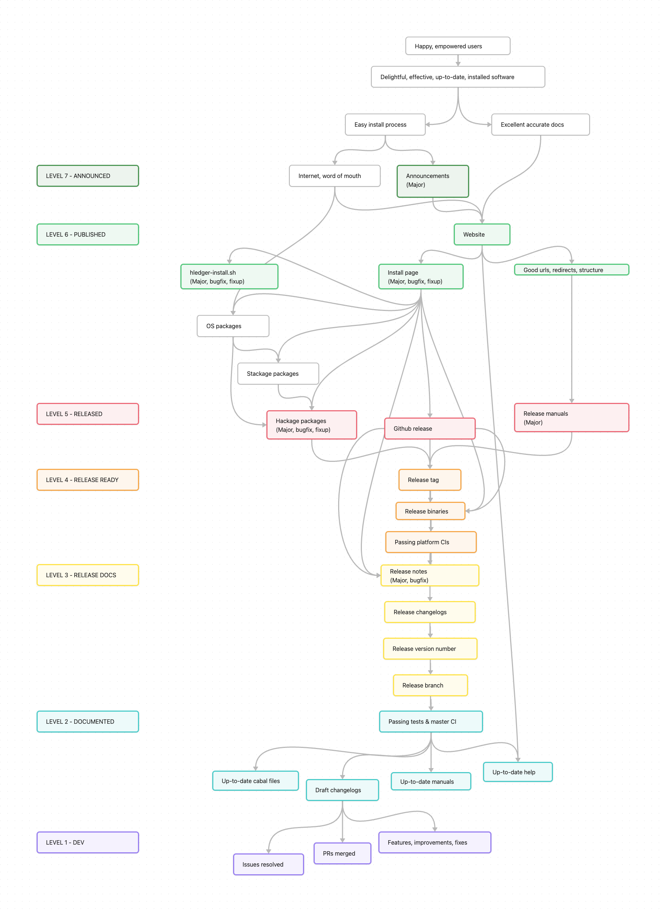

# RELEASING

<!-- toc -->

Notes for hledger release managers and maintainers.

## Goals

**2025**
[ ] Make releasing easier
[ ] Improve automation
[ ] Improve process docs
[ ] Track releasing and release engineering time explicitly, per release
\
**2024**
[x] Make releasing easier
\
**2023**
[x] Make releasing eas<s>y</s>ier
\
**2022**
[x] Update/consolidate release process docs,
[x] Establish routine <s>monthly</s> release cadence,
[ ] Make releasing easy

## hledger release types

hledger major releases happen each quarter, normally at the start of the third month (see [past releases](relnotes.md)).
Bugfix releases follow when needed.
Preview releases may happen in the other months if wanted.

|                     | Major&nbsp;release A.B                                | Bugfix&nbsp;release A.B.C | Fixup&nbsp;release A.B.C.D                | Preview&nbsp;release A.B.99.D         |
|---------------------|----------------------------------------------------------|------------------------------|----------------------------------------------|------------------------------------------|
| **Contains:**       | New features, breaking changes                           | Only bug fixes               | Trivial packaging fixes, no software changes | Early snapshot of the next major release |
| **When:**           | Third month of quarter: March, June, September, December | When needed                  | Never                                        | First & second months of quarter         |
|                     |                                                          |                              |                                              |                                          |
| **Deliverables:**   |                                                          |                              |                                              |                                          |
| Changelogs          | ✓                                                        | ✓                            | ✓                                            | ✓                                        |
| Github release      | ✓                                                        | ✓                            | ✓                                            | ✓                                        |
| Binaries            | ✓                                                        | ✓                            | ✓                                            | ✓                                        |
| Hackage release     | ✓                                                        | ✓                            | ✓                                            |                                          |
| Install page        | ✓                                                        | ✓                            | ✓                                            |                                          |
| hledger-install     | ✓                                                        | ✓                            | ✓                                            |                                          |
| [Regression bounty] | ✓                                                        | ✓                            | ✓                                            |                                          |
| Release notes       | ✓                                                        | ✓                            |                                              |                                          |
| Web manuals         | ✓                                                        |                              |                                              |                                          |
| Announcements       | ✓                                                        |                              |                                              |                                          |

[Regression bounty]: http://hledger.org/regressionbounty

## hledger release artifacts / value chain

Higher things depend on lower things.
Release readiness and the release process go from the bottom of this diagram to the top.

<!-- source: RELEASING.canvas (Obsidian) -->

## Release checklist

This is the guide for doing a hledger release.
It should correspond to the diagram above, but includes more detail of waypoints, required artifacts, and relevant commands.
It should be improved each time it is used.

- [ ] product
  - [ ] blocking defects resolved
  - [ ] desired improvements landed and stabilised
  - [ ] building and passing tests with current ghcs, deps, and stackage snapshots
  - [ ] building and passing tests on all platforms  
        `just relbin` (or push to github `binaries[-*]` branch)
- [ ] product docs and metadata
  - [ ] release branch
  - [ ] version strings (in **/.version, */.version.m4, */package.yaml)
  - [ ] cabal files x 4 (hledger*/hledger*.cabal)  
        `just relbranch VER`,
        `just cabalfilestest`
  - [ ] options help texts up to date (in CliOptions.hs, UIOptions.hs, WebOptions.hs)
  - [ ] embedded manuals x 3
    - [ ] generaloptions macro (in doc/common.m4)
    - [ ] tool specific options in manuals (hledger*/hledger*.m4.md > # Options)
    - [ ] man page dates (*/.date.m4)
    - [ ] man  (hledger*/hledger*.1)
    - [ ] info (hledger*/hledger*.info)
    - [ ] text (hledger*/hledger*.txt)  
        `./Shake manuals -c`
  - [ ] embedded tldr pages synced with upstream (doc/tldr/*)  
        `just tldr-diff`
  - [ ] embedded asciinema demos (hledger/embeddedfiles/*.cast)
  - [ ] shell completions (hledger/shell-completion/hledger-completion.bash)  
        `just completions`, commit any changes
  - [ ] changelogs x 5 (**/CHANGES.md)  
        `just changelogs [-c]`  
        `just changelogs-finalise`
- [ ] release docs and artifacts
  - [ ] draft binaries building started  
      `just relbin`
  - [ ] hledger.org html manuals x 3 (site/src/VER/*.md)  
        `just site-manuals-snapshot VER`  
        update `site/Makefile`, `site/js/site.js`, `site/hledger.org.caddy`
  - [ ] release notes @ hledger.org (doc/relnotes.md)  
      `just relnotes`,  
      select & transform with `md-issue-refs`,  
      uniquify issue refs,  
      add author github nicks,  
      commit
  - [ ] github binary install docs (doc/ghrelnotes.md) up to date and pre-tested
  - [ ] hledger-install/hledger-install.sh up to date and pre-tested  
      (`./Shake hledger-install-version` ?),
      check/update dep versions,  
      select/test snapshot version
  - [ ] Install page (site/src/install.md) up to date and pre-tested
  - [ ] draft announcement for chat / mail list (doc/ANNOUNCE)
  - [ ] draft announcement for mastodon (doc/ANNOUNCE.masto)
  - [ ] release tags  
      `just reltags`
  - [ ] release binaries built from tag  
      `just relbin`
  - [ ] Install page (site/src/install.md) --version examples match release binaries
- [ ] published
  - [ ] relevant release branch work cherry-picked to master branch  
      changelogs
      relnotes
      hledger-install
      announcements
  - [ ] all packages uploaded correctly to hackage  
      `just hackageupload`, check versions, confirm, check all uploads successful
  - [ ] master branch pushed to github
  - [ ] new manuals published and rendering/redirecting correctly  
    - [ ] site repo pushed to github
    - [ ] main and site repos  auto-pulled to hledger.org, site rebuilt
        `hledgerorgsh grep release.= /opt/hledger/site/out/js/site.js`  
    - [ ] https://www.hledger.org/js/site.js showing latest version
        `curl -s https://hledger.org/js/site.js | grep release.=`  
        purge cache at https://dash.cloudflare.com/f629035917dd3b99b1e37ae20c15ff09/hledger.org/caching/configuration
    - [ ] default manual urls redirecting to latest version  
        `hledgerorgsh sh -c 'systemctl stop caddy; systemctl start caddy'`  
        `curl -sI https://hledger.org/hledger.html | grep location`
  - [ ] release branch pushed to github  
  - [ ] release tags pushed to github  
      `just reltags-push VER`
  - [ ] github draft release with release binaries attached  
      (should be autocreated by the above; if not, https://github.com/simonmichael/hledger/releases/new)  
      `just ghrelnotes-push`  
      `just ghruns-download` (or if throttled: `just ghruns-open`, download to tmp/, unzip the unix ones)  
      `just ghrel-upload VER`  
  - [ ] github release published  
      review,
      publish
  - [ ] install instructions tested and working
    - [ ] hledger-install
    - [ ] stack
    - [ ] cabal
    - [ ] source checkout
    - [ ] github release > How to install, each platform
  - [ ] announced
    - [ ] mail list(s) hledger@googlegroups.com, + haskell-cafe@googlegroups.com for major
    - [ ] matrix
    - [ ] irc
    - [ ] mastodon
    - [ ] pta forum
- [ ] cleanup and support
  - [ ] review/polish relnotes, changelogs  
        review, edit  
        propagate
  - [ ] new dev tag/versions/man dates in master  
      `j devtag VER.99`
  - [ ] pta.o project stats updated
  - [ ] process notes updated/cleaned
  - [ ] monitor/support/handle issues:  
      [issue tracker](https://github.com/simonmichael/hledger/issues?q=is%3Aopen+is%3Aissue), matrix, irc, mail list, forum, reddit

After release, it's a good time for:

  - finance repo updates
  - hledger.org doc updates
  - pta.o doc updates

## How to..

More procedure notes.

### Check release readiness

- Any blocking open issues ? <https://bugs.hledger.org>
- Any blocking open PRs ? <https://prs.hledger.org>
- Any blocking items on <https://hledger.org/ROADMAP.html> ?
- Any blocking items in personal notes & backlogs ?

### Check tools are up to date
- Check for consistent stackage snapshot(s) and extra deps used in
  stack.yaml, Shake.hs, hledger-install.sh, bin scripts, tools scripts
- Shake binary is up to date
  `./Shake.hs`
- `hpack --version` matches the one in `stack --version`

### Run local tests
- `just test`
- `just doctest`
- `just haddocktest`

### Run CI tests
- push to a PR, wait for green
- or push to `ci` branch, wait for green at <https://ci.hledger.org>
- or `just push` (pushes to `ci`, then to `master`)

### Run release branch tests
- `just test`
- `stack exec -- hledger --version`, check version, hash, release date, no '+'
- `stack exec -- hledger help | tail`, check version, month matches release

### Update the Install page
In site repo:
- update `install.md`
  - query-replace OLD -> NEW in 
    - "current hledger release"
    - CI binaries badges/links, including linux-static-arm32v7 if built
    - "building from source"
    - stack install command
    - cabal install command
  - query-replace OLD-brightgreen -> OLD-red
  - only after release binaries are built (preferably after release is published):
    update --version outputs (version, hash, date, but not platform)
  - final output line from `hledger test` (run local build and in terminal for normal speed)
  - Total count from `make functest`
  - preview
  - commit: `install: NEW`

### Update hledger in stackage

- monitor packaging status in lts and nightly: <https://www.stackage.org/package/hledger>
- update <https://github.com/fpco/stackage/blob/master/build-constraints.yaml> as needed

### Update RELEASING.png
- edit RELEASING.canvas in obsidian
- CMD-p > Export as image, don't show logo
- commit

## Tips

- Release, or practice releasing, often to improve the process.

- Use and continually update RELEASING.md.
  Document procedures and gotchas to save time and enable automation in future.

- Also the diagram (RELEASING.canvas, made with Obsidian).

- But don't document prematurely or in too much detail.

- Make things a little better each time through: simpler, more reliable, better documented, more automated, easier, faster, cheaper, higher quality.

- Optionally save this file as RELEASING2.md and update notes there until after release, if it's interfering with git branch switching.

- Use and update scripts, in `Justfile`, `Shake.hs`, `tools/` etc.

- Do all releases from a release branch.

- Update dev changelogs frequently in master. Finalise changelogs in the release branch. Merge back to master after release.
  (Related older doc: [CHANGELOGS](CHANGELOGS.md))

- All release binaries should be built from the release-tagged commit.
  The binaries' --version output should match the release tag and release date.

- Try to do only full releases including all four main hledger packages; partial releases add complexity.

- Try to avoid pre-announcing a hard release date. 
  It will always take more time than you think,
  if you go late you might miss your intended date in many timezones,
  and there's no point adding unnecessary pressure.

- The biggest potential time sinks are:

  - reviewing/relearning the process/docs/infrastructure
  - updating/improving the process/docs/infrastructure
  - preparing changelogs
  - building binaries for all platforms
  - troubleshooting github workflow issues
  - followup work due to release mistakes, bugs in new features, or regressions

- Hard/risky/intensive tasks should happen without time pressure;
  during the final countdown, things should be easy.

## Release manager activities

These have complex interdependencies and sequencing constraints.
Chunk, separate, routinise, document and automate them as far as possible.

|                       |                                                                                                                                                            |
|-----------------------|------------------------------------------------------------------------------------------------------------------------------------------------------------|
| **Software**          | selecting changes, packages, release dates; coordinating contributions; ensuring release readiness                                                         |
| **Branch Management** | coordinating main and release branch, local and remote repos, CI branches                                                                                  |
| **Version Bumping**   | choosing and applying new version numbers and related things like tags, github releases, urls, ghc and dep versions, stackage resolvers, everywhere needed |
| **Docs**              | command help, manuals, changelogs, release notes, github release notes, install page, install scripts, announcements, process docs                         |
| **Testing**           | local testing, CI testing, extra release-specific testing                                                                                                  |
| **Artifacts**         | generating binaries, zip files, github releases etc.                                                                                                       |
| **Publishing**        | uploading, pushing, making visible, finalising                                                                                                             |
| **Announcing**        | various announcement stages and channels                                                                                                                   |

## Glossary

Some standard terminology, useful when precision is needed, eg in release scripts.

### General

**release**\
A snapshot of the software and related artifacts like executable binaries, which is named, tagged, documented, announced, and usually picked up by packaging systems on various platforms.

**version control system, VCS**\
A tool used for storing and sharing and viewing the history and different lines of development of a software project, or other set of files. hledger uses Git.

**repository, repo**\
A set of files being stored and managed by a VCS. Often published on a **repository hosting service**, such as Github.

**working copy, clone**\
A local copy of a repository's files. Typically each developer has one or more of these, and can share changes easily with the official public repository.

**branch**\
Some VCS's, including Git, can store multiple branching lines of development within one repository. A working copy can be quickly switched to a different branch to show its content.

**master, main**\
The main branch in a repo, usually named `master` or `main`. Pull requests are usually relative to this.

**pull request, PR**\
A request to merge a development branch with master, and any related discussion. On Github, these are kept alongside issues in the issue tracker.

**continuous integration, CI**\
Automated actions that run when new code is pushed to a shared repo, such as running tests or producing binaries. On Github this is called Github Actions and action scripts are called **workflows**.

**release engineering**\
<https://en.wikipedia.org/wiki/Release_engineering>

### hledger-specific

**package**\
A releasable unit of Haskell software. hledger has several core packages usually released together: hledger-lib, hledger, hledger-ui, hledger-web.

**hledger version number**\
A 2-4 part dotted number naming a hledger release or hledger package version: `MA.JOR[.MINOR[.FIXUP]]` or `MA.JOR.99[.PREVIEW]` where 99 means "unreleased (MAJOR+1)". See examples below.

**hledger version string**\
A line of text describing a hledger binary, shown by `--version`. It contains program name, version number, commit hash and date, machine architecture etc. Eg: `hledger 1.24.1-g7799d526b-20211210, mac-x86_64`

**Full release**\
A release of all four core hledger packages (hledger-lib, hledger, hledger-ui, hledger-web). Major and preview releases are always full releases.

**Partial release**\
A release of just some of the hledger packages. Bugfix and fixup releases are sometimes partial.

**Single-version release**\
A release where all packages have the same version. Major and preview releases are always single-version.

**Mixed-version release**\
A release where the packages have different versions, because of a previous partial release. Bugfix and fixup releases are sometimes mixed-version.

**changelog**\
A CHANGES.md file listing the release history and the changes in each release. There is one for each hledger package and one for the hledger project as a whole.

**release notes**\
The Release Notes page on the hledger website: the combined release history of the core hledger packages, showing user visible changes only.

### Releases and builds

**Major release**\
Major releases include new features and incompatible API changes, and normally happen at the start of each quarter's third month (3/1, 6/1, 9/1, 12/1). Example version number: `1.25`

**Bugfix release**\
Bugfix releases include only bug fixes, without API changes. These happen when needed, to fix significant bugs in the previous major release. Example version number: `1.25.2` (**"second bugfix release for 1.25"**)

**Fixup release**\
Fixup releases fix packaging errors, with no changes to the hledger software. These should be rare. Example version number: `1.25.0.1` or `1.25.2.1` (**"first fixup release for 1.25 / 1.25.2"**)

**Preview release**\
A preview of the upcoming major release for testers/early adopters, and a test of the release process, published on Github. Not a formal hledger release, eg not published on Hackage, usually not packaged, no bugfix releases, no regression bounties, not shown in release notes. These typically appear in the quarter's first and second month if needed. Example version number: `1.25.99.1` (**"preview 1 of 1.26"**)

**CI binaries**\
Temporary downloadable binaries produced by a run of the `linux`/`mac`/`windows` workflows in the hledger repo. This may happen periodically, eg weekly. Downloading requires a Github login.

**Dev build**\
A local developer build of unreleased code. This is typically in `master` or a development/PR branch. Example version number: `1.25.99` (**"unreleased 1.26-dev"**)

### Repos and branches

**hledger repo**\
The `hledger` git repository, containing the hledger software, reference manuals, and developer docs. <https://github.com/simonmichael/hledger>

**site repo**\
The `hledger_website` git repository, containing most of the hledger website which appears at <https://hledger.org>. Usually checked out under the hledger repo as `site/`. <https://github.com/simonmichael/hledger_website>

**finance repo**\
The `hledger_finance` git repository, containing the hledger project's financial ledger. Usually checked out under the hledger repo as `finance/`. <https://github.com/simonmichael/hledger_finance>

**master**\
The branch named `master` in the hledger repo; the main line of hledger development. Pull requests are usually relative to this.

**release&nbsp;branch**\
Branches named `MA.JOR-branch` in the hledger repo, eg `1.25-branch`. Releases and release previews are always made from a release branch.

