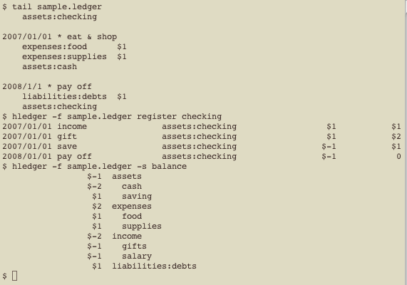

# Old screenshots

---

## Basic command-line reports

Showing the journal format, a register report, and a balance report:

{{http://hledger.org/images/hledger-screen-1.png|Basic command-line reports, like ledger}}

## Time dashboard in emacs

The upper window displays today's time report every minute (using ansi-term, watch, a helper script, and hledger invoked via 'hours' symlink.) The lower window is viewing the timelog file, to tweak clock-ins/clock-outs made with C-x t i and C-x t o.

{{http://hledger.org/images/watchhours.png|The upper window displays today's time report every minute (using ansi-term, watch, a helper script, and hledger invoked via 'hours' symlink.) The lower window is viewing the timelog file, to tweak clock-ins/clock-outs made with C-x t i and C-x t o.}}

## Pie charts (hledger-chart)

Viewing a year of monthly expense charts in emacs. These were generated by hledger 0.10 with -fchart, which became [[http://hackage.haskell.org/package/hledger-chart|hledger-chart]], presently unmaintained.

{{http://hledger.org/images/hledger-charts-2.png|Viewing a year of monthly expense charts in emacs (hledger 0.10 with -fchart).}}

## Curses-style interface (hledger-vty)

[[http://hackage.haskell.org/package/hledger-vty|hledger-vty]], currently unmaintained.

{{http://hledger.org/images/sshot.png|The vty (curses-style) interface}}

## Web interface (hledger-web)

This minimal web interface was hledger 0.11pre with -fwebyesod, which became [[http://hackage.haskell.org/package/hledger-web|hledger-web]].
Here's the [[http://demo.hledger.org|latest interface]].

{{http://hledger.org/images/hledger-web-journal.png|The web interface (hledger 0.11pre with -fwebyesod).}}


<!--
```
zooming version (requires HTML)
Click to enlarge, or mouse over for captions..

<style>
.highslide img {height:90px;}
.highslide-caption {color:white; background-color:black;}
</style>

<a name="hledger-screen-1" href="images/hledger-screen-1.png" class="highslide" onclick="return hs.expand(this)">
 </a>
```
-->
