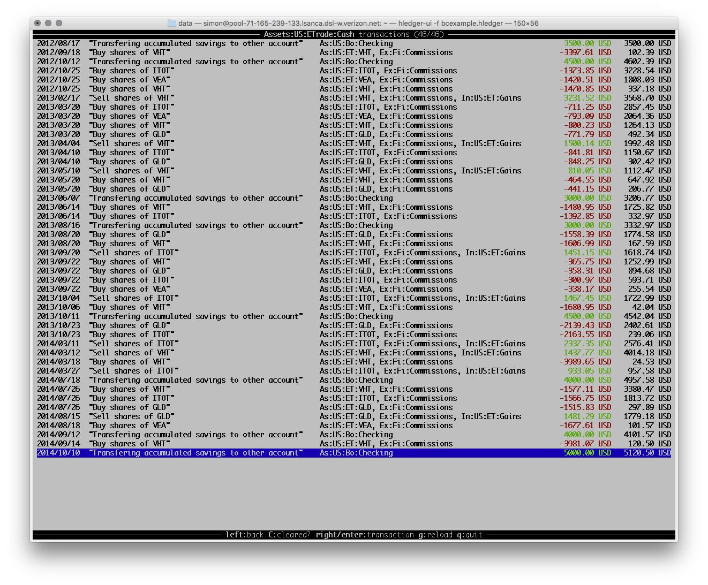

\$toc\$

## hledger

This doc is for version **1.11**. []{.docversions}

### NAME

hledger - a command-line accounting tool

### SYNOPSIS

`hledger [-f FILE] COMMAND [OPTIONS] [ARGS]`\
`hledger [-f FILE] ADDONCMD -- [OPTIONS] [ARGS]`\
`hledger`

### DESCRIPTION

hledger is a cross-platform program for tracking money, time, or any
other commodity, using double-entry accounting and a simple, editable
file format. hledger is inspired by and largely compatible with
ledger(1).\
Tested on unix, mac, windows, hledger aims to be a reliable, practical
tool for daily use.

This is hledger's command-line interface (there are also curses and web
interfaces). Its basic function is to read a plain text file describing
financial transactions (in accounting terms, a general journal) and
print useful reports on standard output, or export them as CSV. hledger
can also read some other file formats such as CSV files, translating
them to journal format. Additionally, hledger lists other hledger-\*
executables found in the user's \$PATH and can invoke them as
subcommands.

hledger reads data from one or more files in hledger journal, timeclock,
timedot, or CSV format specified with `-f`, or `$LEDGER_FILE`, or
`$HOME/.hledger.journal` (on windows, perhaps
`C:/Users/USER/.hledger.journal`). If using `$LEDGER_FILE`, note this
must be a real environment variable, not a shell variable. You can
specify standard input with `-f-`.

Transactions are dated movements of money between two (or more) named
accounts, and are recorded with journal entries like this:

``` {.journal}
2015/10/16 bought food
 expenses:food          $10
 assets:cash
```

For more about this format, see hledger\_journal(5).

Most users use a text editor to edit the journal, usually with an editor
mode such as ledger-mode for added convenience. hledger's interactive
add command is another way to record new transactions. hledger never
changes existing transactions.

To get started, you can either save some entries like the above in
`~/.hledger.journal`, or run `hledger add` and follow the prompts. Then
try some commands like `hledger print` or `hledger balance`. Run
`hledger` with no arguments for a list of commands.

### EXAMPLES

Two simple transactions in hledger journal format:

``` {.journal}
2015/9/30 gift received
  assets:cash   $20
  income:gifts

2015/10/16 farmers market
  expenses:food    $10
  assets:cash
```

Some basic reports:

``` {.shell}
$ hledger print
2015/09/30 gift received
    assets:cash            $20
    income:gifts          $-20

2015/10/16 farmers market
    expenses:food           $10
    assets:cash            $-10
```

``` {.shell}
$ hledger accounts --tree
assets
  cash
expenses
  food
income
  gifts
```

``` {.shell}
$ hledger balance
                 $10  assets:cash
                 $10  expenses:food
                $-20  income:gifts
--------------------
                   0
```

``` {.shell}
$ hledger register cash
2015/09/30 gift received   assets:cash               $20           $20
2015/10/16 farmers market  assets:cash              $-10           $10
```

More commands:

``` {.shell}
$ hledger                                 # show available commands
$ hledger add                             # add more transactions to the journal file
$ hledger balance                         # all accounts with aggregated balances
$ hledger balance --help                  # show detailed help for balance command
$ hledger balance --depth 1               # only top-level accounts
$ hledger register                        # show account postings, with running total
$ hledger reg income                      # show postings to/from income accounts
$ hledger reg 'assets:some bank:checking' # show postings to/from this checking account
$ hledger print desc:shop                 # show transactions with shop in the description
$ hledger activity -W                     # show transaction counts per week as a bar chart
```

### OPTIONS

#### General options

To see general usage help, including general options which are supported
by most hledger commands, run `hledger -h`.

General help options:

`-h --help`
:   show general usage (or after COMMAND, command usage)

`--version`
:   show version

`--debug[=N]`
:   show debug output (levels 1-9, default: 1)

General input options:

`-f FILE --file=FILE`
:   use a different input file. For stdin, use - (default:
    `$LEDGER_FILE` or `$HOME/.hledger.journal`)

`--rules-file=RULESFILE`
:   Conversion rules file to use when reading CSV (default: FILE.rules)

`--separator=CHAR`
:   Field separator to expect when reading CSV (default: ',')

`--alias=OLD=NEW`
:   rename accounts named OLD to NEW

`--anon`
:   anonymize accounts and payees

`--pivot FIELDNAME`
:   use some other field or tag for the account name

`-I --ignore-assertions`
:   ignore any failing balance assertions

General reporting options:

`-b --begin=DATE`
:   include postings/txns on or after this date

`-e --end=DATE`
:   include postings/txns before this date

`-D --daily`
:   multiperiod/multicolumn report by day

`-W --weekly`
:   multiperiod/multicolumn report by week

`-M --monthly`
:   multiperiod/multicolumn report by month

`-Q --quarterly`
:   multiperiod/multicolumn report by quarter

`-Y --yearly`
:   multiperiod/multicolumn report by year

`-p --period=PERIODEXP`
:   set start date, end date, and/or reporting interval all at once
    using [period expressions](manual.html#period-expressions) syntax
    (overrides the flags above)

`--date2`
:   match the secondary date instead (see command help for other
    effects)

`-U --unmarked`
:   include only unmarked postings/txns (can combine with -P or -C)

`-P --pending`
:   include only pending postings/txns

`-C --cleared`
:   include only cleared postings/txns

`-R --real`
:   include only non-virtual postings

`-NUM --depth=NUM`
:   hide/aggregate accounts or postings more than NUM levels deep

`-E --empty`
:   show items with zero amount, normally hidden (and vice-versa in
    hledger-ui/hledger-web)

`-B --cost`
:   convert amounts to their cost at transaction time (using the
    [transaction price](journal.html#transaction-prices), if any)

`-V --value`
:   convert amounts to their market value on the report end date (using
    the most recent applicable [market
    price](journal.html#market-prices), if any)

`--auto`
:   apply [automated posting
    rules](journal.html#automated-posting-rules) to modify transactions.

`--forecast`
:   apply [periodic transaction](journal.html#periodic-transactions)
    rules to generate future transactions, to 6 months from now or
    report end date.

When a reporting option appears more than once in the command line, the
last one takes precedence.

Some reporting options can also be written as [query
arguments](#queries).

#### Command options

To see options for a particular command, including command-specific
options, run: `hledger COMMAND -h`.

Command-specific options must be written after the command name, eg:
`hledger print -x`.

Additionally, if the command is an [addon](#commands), you may need to
put its options after a double-hyphen, eg: `hledger ui -- --watch`. Or,
you can run the addon executable directly: `hledger-ui --watch`.

#### Command arguments

Most hledger commands accept arguments after the command name, which are
often a [query](#queries), filtering the data in some way.

#### Argument files

You can save a set of command line options/arguments in a file, one per
line, and then reuse them by writing `@FILENAME` in a command line. To
prevent this expansion of `@`-arguments, precede them with a `--`
argument. For more, see [Save frequently used
options](https://github.com/simonmichael/hledger/wiki/Save-frequently-used-options).

#### Special characters

Option and argument values which contain problematic characters should
be escaped with double quotes, backslashes, or (best) single quotes.
Problematic characters means spaces, and also characters which are
significant to your command shell, such as less-than/greater-than. Eg:
`hledger register -p 'last year' "accounts receivable (receivable|payable)" amt:\>100`.

Characters which are significant both to the shell and in [regular
expressions](#regular-expressions) sometimes need to be double-escaped.
These include parentheses, the pipe symbol and the dollar sign. Eg, to
match the dollar symbol, bash users should do:
`hledger balance cur:'\$'` or `hledger balance cur:\\$`.

When hledger is invoking an addon executable (like hledger-ui), options
and arguments get de-escaped once more, so you might need
*triple*-escaping. Eg: `hledger ui cur:'\\$'` or `hledger ui cur:\\\\$`
in bash. (The number of backslashes in fish shell is left as an exercise
for the reader.)

Inside a file used for [argument expansion](#argument-expansion), one
less level of escaping is enough. (And in this case, backslashes seem to
work better than quotes. Eg: `cur:\$`).

If in doubt, keep things simple:

-   run add-on executables directly
-   write options after the command
-   enclose problematic args in single quotes
-   if needed, also add a backslash to escape regexp metacharacters

If you're really stumped, add `--debug=2` to troubleshoot.

#### Input files

hledger reads transactions from a data file (and the add command writes
to it). By default this file is `$HOME/.hledger.journal` (or on Windows,
something like `C:/Users/USER/.hledger.journal`). You can override this
with the `$LEDGER_FILE` environment variable:

``` {.bash}
$ setenv LEDGER_FILE ~/finance/2016.journal
$ hledger stats
```

or with the `-f/--file` option:

``` {.bash}
$ hledger -f /some/file stats
```

The file name `-` (hyphen) means standard input:

``` {.bash}
$ cat some.journal | hledger -f-
```

Usually the data file is in hledger's journal format, but it can also be
one of several other formats, listed below. hledger detects the format
automatically based on the file extension, or if that is not recognised,
by trying each built-in "reader" in turn:

  ----------------------------------------------------------------------
  Reader:       Reads:                          Used for file
                                                extensions:
  ------------- ------------------------------- ------------------------
  `journal`     hledger's journal format, also  `.journal` `.j`
                some Ledger journals            `.hledger` `.ledger`

  `timeclock`   timeclock files (precise time   `.timeclock`
                logging)                        

  `timedot`     timedot files (approximate time `.timedot`
                logging)                        

  `csv`         comma-separated values (data    `.csv`
                interchange)                    
  ----------------------------------------------------------------------

If needed (eg to ensure correct error messages when a file has the
"wrong" extension), you can force a specific reader/format by prepending
it to the file path with a colon. Examples:

``` {.bash}
$ hledger -f csv:/some/csv-file.dat stats
$ echo 'i 2009/13/1 08:00:00' | hledger print -ftimeclock:-
```

You can also specify multiple `-f` options, to read multiple files as
one big journal. There are some limitations with this:

-   directives in one file will not affect the other files
-   [balance assertions](/journal.html#balance-assertions) will not see
    any account balances from previous files

If you need those, either use the [include
directive](/journal.html#including-other-files), or concatenate the
files, eg: `cat a.journal b.journal | hledger -f- CMD`.

#### Smart dates

hledger's user interfaces accept a flexible "smart date" syntax (unlike
dates in the journal file). Smart dates allow some english words, can be
relative to today's date, and can have less-significant date parts
omitted (defaulting to 1).

Examples:

  ---------------------------------------------- ---------------------------------------------------------------------------------------
  `2004/10/1`, `2004-01-01`, `2004.9.1`          exact date, several separators allowed. Year is 4+ digits, month is 1-12, day is 1-31
  `2004`                                         start of year
  `2004/10`                                      start of month
  `10/1`                                         month and day in current year
  `21`                                           day in current month
  `october, oct`                                 start of month in current year
  `yesterday, today, tomorrow`                   -1, 0, 1 days from today
  `last/this/next day/week/month/quarter/year`   -1, 0, 1 periods from the current period
  `20181201`                                     8 digit YYYYMMDD with valid year month and day
  `201812`                                       6 digit YYYYMM with valid year and month
  ---------------------------------------------- ---------------------------------------------------------------------------------------

Counterexamples - malformed digit sequences might give surprising
results:

  ------------- -------------------------------------------------------------------
  `201813`      6 digits with an invalid month is parsed as start of 6-digit year
  `20181301`    8 digits with an invalid month is parsed as start of 8-digit year
  `20181232`    8 digits with an invalid day gives an error
  `201801012`   9+ digits beginning with a valid YYYYMMDD gives an error
  ------------- -------------------------------------------------------------------

#### Report start & end date

Most hledger reports show the full span of time represented by the
journal data, by default. So, the effective report start and end dates
will be the earliest and latest transaction or posting dates found in
the journal.

Often you will want to see a shorter time span, such as the current
month. You can specify a start and/or end date using
[`-b/--begin`](#reporting-options), [`-e/--end`](#reporting-options),
[`-p/--period`](#period-expressions) or a [`date:` query](#queries)
(described below). All of these accept the [smart date](#smart-dates)
syntax. One important thing to be aware of when specifying end dates: as
in Ledger, end dates are exclusive, so you need to write the date
*after* the last day you want to include.

Examples:

  ------------------- ---------------------------------------------------------------------------------------------
  `-b 2016/3/17`      begin on St. Patrick's day 2016
  `-e 12/1`           end at the start of december 1st of the current year (11/30 will be the last date included)
  `-b thismonth`      all transactions on or after the 1st of the current month
  `-p thismonth`      all transactions in the current month
  `date:2016/3/17-`   the above written as queries instead
  `date:-12/1`        
  `date:thismonth-`   
  `date:thismonth`    
  ------------------- ---------------------------------------------------------------------------------------------

#### Report intervals

A report interval can be specified so that commands like
[register](#register), [balance](#balance) and [activity](#activity)
will divide their reports into multiple subperiods. The basic intervals
can be selected with one of `-D/--daily`, `-W/--weekly`, `-M/--monthly`,
`-Q/--quarterly`, or `-Y/--yearly`. More complex intervals may be
specified with a [period expression](#period-expressions). Report
intervals can not be specified with a [query](#queries), currently.

#### Period expressions

The `-p/--period` option accepts period expressions, a shorthand way of
expressing a start date, end date, and/or report interval all at once.

Here's a basic period expression specifying the first quarter of 2009.
Note, hledger always treats start dates as inclusive and end dates as
exclusive:

`-p "from 2009/1/1 to 2009/4/1"`

Keywords like "from" and "to" are optional, and so are the spaces, as
long as you don't run two dates together. "to" can also be written as
"-". These are equivalent to the above:

  --------------------------
  `-p "2009/1/1 2009/4/1"`
  `-p2009/1/1to2009/4/1`
  `-p2009/1/1-2009/4/1`
  --------------------------

Dates are [smart dates](#smart-dates), so if the current year is 2009,
the above can also be written as:

  -------------------------
  `-p "1/1 4/1"`
  `-p "january-apr"`
  `-p "this year to 4/1"`
  -------------------------

If you specify only one date, the missing start or end date will be the
earliest or latest transaction in your journal:

  ---------------------- -----------------------------------
  `-p "from 2009/1/1"`   everything after january 1, 2009
  `-p "from 2009/1"`     the same
  `-p "from 2009"`       the same
  `-p "to 2009"`         everything before january 1, 2009
  ---------------------- -----------------------------------

A single date with no "from" or "to" defines both the start and end date
like so:

  ----------------- --------------------------------------------------------
  `-p "2009"`       the year 2009; equivalent to "2009/1/1 to 2010/1/1"
  `-p "2009/1"`     the month of jan; equivalent to "2009/1/1 to 2009/2/1"
  `-p "2009/1/1"`   just that day; equivalent to "2009/1/1 to 2009/1/2"
  ----------------- --------------------------------------------------------

The argument of `-p` can also begin with, or be, a [report
interval](#report-intervals) expression. The basic report intervals are
`daily`, `weekly`, `monthly`, `quarterly`, or `yearly`, which have the
same effect as the `-D`,`-W`,`-M`,`-Q`, or `-Y` flags. Between report
interval and start/end dates (if any), the word `in` is optional.
Examples:

  -----------------------------------------
  `-p "weekly from 2009/1/1 to 2009/4/1"`
  `-p "monthly in 2008"`
  `-p "quarterly"`
  -----------------------------------------

Note that `weekly`, `monthly`, `quarterly` and `yearly` intervals will
always start on the first day on week, month, quarter or year
accordingly, and will end on the last day of same period, even if
associated period expression specifies different explicit start and end
date.

For example:

  -------------------------------------------------------------------------------------------------------------------------------------
  `-p "weekly from 2009/1/1 to 2009/4/1"` -- starts on 2008/12/29, closest preceeding Monday
  `-p "monthly in 2008/11/25"` -- starts on 2018/11/01
  `-p "quarterly from 2009-05-05 to 2009-06-01"` - starts on 2009/04/01, ends on 2009/06/30, which are first and last days of Q2 2009
  `-p "yearly from 2009-12-29"` - starts on 2009/01/01, first day of 2009
  -------------------------------------------------------------------------------------------------------------------------------------

The following more complex report intervals are also supported:
`biweekly`, `bimonthly`, `every day|week|month|quarter|year`,
`every N days|weeks|months|quarters|years`.

All of these will start on the first day of the requested period and end
on the last one, as described above.

Examples:

  --------------------------------------------------------------------------------------------------
  `-p "bimonthly from 2008"` -- periods will have boundaries on 2008/01/01, 2008/03/01, ...
  `-p "every 2 weeks"` -- starts on closest preceeding Monday
  `-p "every 5 month from 2009/03"` -- periods will have boundaries on 2009/03/01, 2009/08/01, ...
  --------------------------------------------------------------------------------------------------

If you want intervals that start on arbitrary day of your choosing and
span a week, month or year, you need to use any of the following:

`every Nth day of week`, `every <weekday>`, `every Nth day [of month]`,
`every Nth weekday [of month]`, `every MM/DD [of year]`,
`every Nth MMM [of year]`, `every MMM Nth [of year]`.

Examples:

  -------------------------------------------------------------------------------------
  `-p "every 2nd day of week"` -- periods will go from Tue to Tue
  `-p "every Tue"` -- same
  `-p "every 15th day"` -- period boundaries will be on 15th of each month
  `-p "every 2nd Monday"` -- period boundaries will be on second Monday of each month
  `-p "every 11/05"` -- yearly periods with boundaries on 5th of Nov
  `-p "every 5th Nov"` -- same
  `-p "every Nov 5th"` -- same
  -------------------------------------------------------------------------------------

Show historical balances at end of 15th each month (N is exclusive end
date):

`hledger balance -H -p "every 16th day"`

Group postings from start of wednesday to end of next tuesday (N is
start date and exclusive end date):

`hledger register checking -p "every 3rd day of week"`

#### Depth limiting

With the `--depth N` option (short form: `-N`), commands like
[account](#account), [balance](#balance) and [register](#register) will
show only the uppermost accounts in the account tree, down to level N.
Use this when you want a summary with less detail. This flag has the
same effect as a `depth:` query argument (so `-2`, `--depth=2` or
`depth:2` are basically equivalent).

#### Pivoting

Normally hledger sums amounts, and organizes them in a hierarchy, based
on account name. The `--pivot FIELD` option causes it to sum and
organize hierarchy based on the value of some other field instead. FIELD
can be: `code`, `description`, `payee`, `note`, or the full name (case
insensitive) of any [tag](/journal.html#tags). As with account names,
values containing `colon:separated:parts` will be displayed
hierarchically in reports.

`--pivot` is a general option affecting all reports; you can think of
hledger transforming the journal before any other processing, replacing
every posting's account name with the value of the specified field on
that posting, inheriting it from the transaction or using a blank value
if it's not present.

An example:

``` {.journal}
2016/02/16 Member Fee Payment
    assets:bank account                    2 EUR
    income:member fees                    -2 EUR  ; member: John Doe
```

Normal balance report showing account names:

``` {.shell}
$ hledger balance
               2 EUR  assets:bank account
              -2 EUR  income:member fees
--------------------
                   0
```

Pivoted balance report, using member: tag values instead:

``` {.shell}
$ hledger balance --pivot member
               2 EUR
              -2 EUR  John Doe
--------------------
                   0
```

One way to show only amounts with a member: value (using a
[query](#queries), described below):

``` {.shell}
$ hledger balance --pivot member tag:member=.
              -2 EUR  John Doe
--------------------
              -2 EUR
```

Another way (the acct: query matches against the pivoted "account
name"):

    $ hledger balance --pivot member acct:.
                  -2 EUR  John Doe
    --------------------
                  -2 EUR

#### Cost

The `-B/--cost` flag converts amounts to their cost at transaction time,
if they have a [transaction price](/journal.html#transaction-prices)
specified.

#### Market value

The `-V/--value` flag converts reported amounts to their current market
value.\
Specifically, when there is a [market price](journal.html#market-prices)
(P directive) for the amount's commodity, dated on or before today's
date (or the [report end date](#report-start-end-date) if specified),
the amount will be converted to the price's commodity.

When there are multiple applicable P directives, -V chooses the most
recent one, or in case of equal dates, the last-parsed one.

For example:

``` {.journal}
# one euro is worth this many dollars from nov 1
P 2016/11/01 € $1.10

# purchase some euros on nov 3
2016/11/3
    assets:euros        €100
    assets:checking

# the euro is worth fewer dollars by dec 21
P 2016/12/21 € $1.03
```

How many euros do I have ?

    $ hledger -f t.j bal -N euros
                    €100  assets:euros

What are they worth at end of nov 3 ?

    $ hledger -f t.j bal -N euros -V -e 2016/11/4
                 $110.00  assets:euros

What are they worth after 2016/12/21 ? (no report end date specified,
defaults to today)

    $ hledger -f t.j bal -N euros -V
                 $103.00  assets:euros

Currently, hledger's -V only uses market prices recorded with P
directives, not [transaction prices](journal.html#transaction-prices)
(unlike Ledger).

Currently, -V has a limitation in [multicolumn balance
reports](#multicolumn-balance-reports): it uses the market prices on the
report end date for all columns. (Instead of the prices on each column's
end date.)

#### Combining -B and -V

Using -B/--cost and -V/--value together is currently allowed, but the
results are probably not meaningful. Let us know if you find a use for
this.

#### Output destination

Some commands (print, register, stats, the balance commands) can write
their output to a destination other than the console. This is controlled
by the `-o/--output-file` option.

``` {.shell}
$ hledger balance -o -     # write to stdout (the default)
$ hledger balance -o FILE  # write to FILE
```

#### Output format

Some commands can write their output in other formats. Eg print and
register can output CSV, and the balance commands can output CSV or
HTML. This is controlled by the `-O/--output-format` option, or by
specifying a `.csv` or `.html` file extension with `-o/--output-file`.

``` {.shell}
$ hledger balance -O csv       # write CSV to stdout
$ hledger balance -o FILE.csv  # write CSV to FILE.csv
```

#### Regular expressions

hledger uses [regular expressions](http://www.regular-expressions.info)
in a number of places:

-   [query terms](#queries), on the command line and in the hledger-web
    search form: `REGEX`, `desc:REGEX`, `cur:REGEX`, `tag:...=REGEX`
-   [CSV rules](#csv-rules) conditional blocks: `if REGEX ...`
-   [account alias](#rewriting-accounts) directives and options:
    `alias /REGEX/ = REPLACEMENT`, `--alias /REGEX/=REPLACEMENT`

hledger's regular expressions come from the
[regex-tdfa](http://hackage.haskell.org/package/regex-tdfa/docs/Text-Regex-TDFA.html)
library. In general they:

-   are case insensitive
-   are infix matching (do not need to match the entire thing being
    matched)
-   are [POSIX extended regular
    expressions](http://www.regular-expressions.info/posix.html#ere)
-   also support [GNU word
    boundaries](http://www.regular-expressions.info/wordboundaries.html)
    (\\\<, \\\>, \\b, \\B)
-   and parenthesised [capturing
    groups](http://www.regular-expressions.info/refcapture.html) and
    numeric backreferences in replacement strings
-   do not support [mode
    modifiers](http://www.regular-expressions.info/modifiers.html) like
    (?s)

Some things to note:

-   In the `alias` directive and `--alias` option, regular expressions
    must be enclosed in forward slashes (`/REGEX/`). Elsewhere in
    hledger, these are not required.

-   In queries, to match a regular expression metacharacter like `$` as
    a literal character, prepend a backslash. Eg to search for amounts
    with the dollar sign in hledger-web, write `cur:\$`.

-   On the command line, some metacharacters like `$` have a special
    meaning to the shell and so must be escaped at least once more. See
    [Special characters](#special-characters).

### QUERIES

One of hledger's strengths is being able to quickly report on precise
subsets of your data. Most commands accept an optional query expression,
written as arguments after the command name, to filter the data by date,
account name or other criteria. The syntax is similar to a web search:
one or more space-separated search terms, quotes to enclose whitespace,
prefixes to match specific fields, a not: prefix to negate the match.

We do not yet support arbitrary boolean combinations of search terms;
instead most commands show transactions/postings/accounts which match
(or negatively match):

-   any of the description terms AND
-   any of the account terms AND
-   any of the status terms AND
-   all the other terms.

The [print](/manual.html#print) command instead shows transactions
which:

-   match any of the description terms AND
-   have any postings matching any of the positive account terms AND
-   have no postings matching any of the negative account terms AND
-   match all the other terms.

The following kinds of search terms can be used. Remember these can also
be prefixed with **`not:`**, eg to exclude a particular subaccount.

**`REGEX`, `acct:REGEX`**
:   match account names by this regular expression. (With no prefix,
    `acct:` is assumed.)
:   same as above

**`amt:N, amt:<N, amt:<=N, amt:>N, amt:>=N`**
:   match postings with a single-commodity amount that is equal to, less
    than, or greater than N. (Multi-commodity amounts are not tested,
    and will always match.) The comparison has two modes: if N is
    preceded by a + or - sign (or is 0), the two signed numbers are
    compared. Otherwise, the absolute magnitudes are compared, ignoring
    sign.

**`code:REGEX`**
:   match by transaction code (eg check number)

**`cur:REGEX`**
:   match postings or transactions including any amounts whose
    currency/commodity symbol is fully matched by REGEX. (For a partial
    match, use `.*REGEX.*`). Note, to match characters which are
    regex-significant, like the dollar sign (`$`), you need to prepend
    `\`. And when using the command line you need to add one more level
    of quoting to hide it from the shell, so eg do:
    `hledger print cur:'\$'` or `hledger print cur:\\$`.

**`desc:REGEX`**
:   match transaction descriptions.

**`date:PERIODEXPR`**
:   match dates within the specified period. PERIODEXPR is a [period
    expression](#period-expressions) (with no report interval).
    Examples: `date:2016`, `date:thismonth`, `date:2000/2/1-2/15`,
    `date:lastweek-`. If the `--date2` command line flag is present,
    this matches [secondary dates](manual.html#secondary-dates) instead.

**`date2:PERIODEXPR`**
:   match secondary dates within the specified period.

**`depth:N`**
:   match (or display, depending on command) accounts at or above this
    depth

**`note:REGEX`**
:   match transaction [notes](/manual.html#payee-and-note) (part of
    description right of `|`, or whole description when there's no `|`)

**`payee:REGEX`**
:   match transaction [payee/payer names](/manual.html#payee-and-note)
    (part of description left of `|`, or whole description when there's
    no `|`)

**`real:, real:0`**
:   match real or virtual postings respectively

**`status:, status:!, status:*`**
:   match unmarked, pending, or cleared transactions respectively

**`tag:REGEX[=REGEX]`**
:   match by tag name, and optionally also by tag value. Note a tag:
    query is considered to match a transaction if it matches any of the
    postings. Also remember that postings inherit the tags of their
    parent transaction.

The following special search term is used automatically in hledger-web,
only:

**`inacct:ACCTNAME`**
:   tells hledger-web to show the transaction register for this account.
    Can be filtered further with `acct` etc.

Some of these can also be expressed as command-line options (eg
`depth:2` is equivalent to `--depth 2`). Generally you can mix options
and query arguments, and the resulting query will be their intersection
(perhaps excluding the `-p/--period` option).

### COMMANDS

hledger provides a number of subcommands; `hledger` with no arguments
shows a list.

If you install additional `hledger-*` packages, or if you put programs
or scripts named `hledger-NAME` in your PATH, these will also be listed
as subcommands.

Run a subcommand by writing its name as first argument (eg
`hledger incomestatement`). You can also write one of the standard short
aliases displayed in parentheses in the command list (`hledger b`), or
any any unambiguous prefix of a command name (`hledger inc`).

Here are all the builtin commands in alphabetical order. See also
`hledger` for a more organised command list, and `hledger CMD -h` for
detailed command help.

<!--
---
comment:
for each command: name, synopsis, description, examples.
...
-->
#### accounts

Show account names. Alias: a.

`--declared`
:   show account names declared with account directives

`--used`
:   show account names posted to by transactions

`--tree`
:   show short account names and their parents, as a tree

`--flat`
:   show full account names, as a list (default)

`--drop=N`
:   in flat mode: omit N leading account name parts

This command lists account names, either declared with account
directives (--declared), posted to (--used), or both (default). With
query arguments, only matched account names and account names referenced
by matched postings are shown. It shows a flat list by default. With
`--tree`, it uses indentation to show the account hierarchy. In flat
mode you can add `--drop N` to omit the first few account name
components. Account names can be depth-clipped with `--depth N` or
depth:N.

Examples:

<div class="container-fluid">

<div class="row">

<div class="col-sm-4">

``` {.shell}
$ hledger accounts --tree
assets
  bank
    checking
    saving
  cash
expenses
  food
  supplies
income
  gifts
  salary
liabilities
  debts
```

</div>

<div class="col-sm-4">

``` {.shell}
$ hledger accounts --drop 1
bank:checking
bank:saving
cash
food
supplies
gifts
salary
debts
```

</div>

<div class="col-sm-4">

``` {.shell}
$ hledger accounts
assets:bank:checking
assets:bank:saving
assets:cash
expenses:food
expenses:supplies
income:gifts
income:salary
liabilities:debts
```

</div>

</div>

</div>

#### activity

Show an ascii barchart of posting counts per interval.

The activity command displays an ascii histogram showing transaction
counts by day, week, month or other reporting interval (by day is the
default). With query arguments, it counts only matched transactions.

``` {.shell}
$ hledger activity --quarterly
2008-01-01 **
2008-04-01 *******
2008-07-01 
2008-10-01 **
```

#### add

Prompt for transactions and add them to the journal.

`--no-new-accounts`
:   don't allow creating new accounts; helps prevent typos when entering
    account names

Many hledger users edit their journals directly with a text editor, or
generate them from CSV. For more interactive data entry, there is the
`add` command, which prompts interactively on the console for new
transactions, and appends them to the journal file (if there are
multiple `-f FILE` options, the first file is used.) Existing
transactions are not changed. This is the only hledger command that
writes to the journal file.

To use it, just run `hledger add` and follow the prompts. You can add as
many transactions as you like; when you are finished, enter `.` or press
control-d or control-c to exit.

Features:

-   add tries to provide useful defaults, using the most similar recent
    transaction (by description) as a template.
-   You can also set the initial defaults with command line arguments.
-   [Readline-style edit
    keys](http://tiswww.case.edu/php/chet/readline/rluserman.html#SEC3)
    can be used during data entry.
-   The tab key will auto-complete whenever possible - accounts,
    descriptions, dates (`yesterday`, `today`, `tomorrow`). If the input
    area is empty, it will insert the default value.
-   If the journal defines a [default commodity](#default-commodity), it
    will be added to any bare numbers entered.
-   A parenthesised transaction [code](#entries) may be entered
    following a date.
-   [Comments](#comments) and tags may be entered following a
    description or amount.
-   If you make a mistake, enter `<` at any prompt to restart the
    transaction.
-   Input prompts are displayed in a different colour when the terminal
    supports it.

Example (see the
[tutorial](step-by-step.html#record-a-transaction-with-hledger-add) for
a detailed explanation):

``` {.shell}
$ hledger add
Adding transactions to journal file /src/hledger/examples/sample.journal
Any command line arguments will be used as defaults.
Use tab key to complete, readline keys to edit, enter to accept defaults.
An optional (CODE) may follow transaction dates.
An optional ; COMMENT may follow descriptions or amounts.
If you make a mistake, enter < at any prompt to restart the transaction.
To end a transaction, enter . when prompted.
To quit, enter . at a date prompt or press control-d or control-c.
Date [2015/05/22]: 
Description: supermarket
Account 1: expenses:food
Amount  1: $10
Account 2: assets:checking
Amount  2 [$-10.0]: 
Account 3 (or . or enter to finish this transaction): .
2015/05/22 supermarket
    expenses:food             $10
    assets:checking        $-10.0

Save this transaction to the journal ? [y]: 
Saved.
Starting the next transaction (. or ctrl-D/ctrl-C to quit)
Date [2015/05/22]: <CTRL-D> $
```

#### balance

Show accounts and their balances. Aliases: b, bal.

`--change`
:   show balance change in each period (default)

`--cumulative`
:   show balance change accumulated across periods (in multicolumn
    reports)

`-H --historical`
:   show historical ending balance in each period (includes postings
    before report start date)

`--tree`
:   show accounts as a tree; amounts include subaccounts (default in
    simple reports)

`--flat`
:   show accounts as a list; amounts exclude subaccounts except when
    account is depth-clipped (default in multicolumn reports)

`-A --average`
:   show a row average column (in multicolumn mode)

`-T --row-total`
:   show a row total column (in multicolumn mode)

`-N --no-total`
:   don't show the final total row

`--drop=N`
:   omit N leading account name parts (in flat mode)

`--no-elide`
:   don't squash boring parent accounts (in tree mode)

`--format=LINEFORMAT`
:   in single-column balance reports: use this custom line format

`-O FMT --output-format=FMT`
:   select the output format. Supported formats: txt, csv, html.

`-o FILE --output-file=FILE`
:   write output to FILE. A file extension matching one of the above
    formats selects that format.

`--pretty-tables`
:   use unicode to display prettier tables.

`--sort-amount`
:   sort by amount instead of account code/name (in flat mode). With
    multiple columns, sorts by the row total, or by row average if that
    is displayed.

`--invert`
:   display all amounts with reversed sign

`--budget`
:   show performance compared to budget goals defined by [periodic
    transactions](journal.html#periodic-transactions)

`--show-unbudgeted`
:   with --budget, show unbudgeted accounts also

The balance command is hledger's most versatile command. Note, despite
the name, it is not always used for showing real-world account balances;
the more accounting-aware [balancesheet](#balancesheet) and
[incomestatement](#incomestatement) may be more convenient for that.

By default, it displays all accounts, and each account's change in
balance during the entire period of the journal. Balance changes are
calculated by adding up the postings in each account. You can limit the
postings matched, by a [query](#queries), to see fewer accounts, changes
over a different time period, changes from only cleared transactions,
etc.

If you include an account's complete history of postings in the report,
the balance change is equivalent to the account's current ending
balance. For a real-world account, typically you won't have all
transactions in the journal; instead you'll have all transactions after
a certain date, and an "opening balances" transaction setting the
correct starting balance on that date. Then the balance command will
show real-world account balances. In some cases the -H/--historical flag
is used to ensure this (more below).

The balance command can produce several styles of report:

##### Classic balance report

This is the original balance report, as found in Ledger. It usually
looks like this:

``` {.shell}
$ hledger balance
                 $-1  assets
                  $1    bank:saving
                 $-2    cash
                  $2  expenses
                  $1    food
                  $1    supplies
                 $-2  income
                 $-1    gifts
                 $-1    salary
                  $1  liabilities:debts
--------------------
                   0
```

By default, accounts are displayed hierarchically, with subaccounts
indented below their parent. At each level of the tree, accounts are
sorted by [account code](/manual.html#declaring-accounts) if any, then
by account name. Or with `-S/--sort-amount`, by their balance amount.

"Boring" accounts, which contain a single interesting subaccount and no
balance of their own, are elided into the following line for more
compact output. (Eg above, the "liabilities" account.) Use `--no-elide`
to prevent this.

Account balances are "inclusive" - they include the balances of any
subaccounts.

Accounts which have zero balance (and no non-zero subaccounts) are
omitted. Use `-E/--empty` to show them.

A final total is displayed by default; use `-N/--no-total` to suppress
it, eg:

``` {.shell}
$ hledger balance -p 2008/6 expenses --no-total
                  $2  expenses
                  $1    food
                  $1    supplies
```

##### Customising the classic balance report

You can customise the layout of classic balance reports with
`--format FMT`:

``` {.shell}
$ hledger balance --format "%20(account) %12(total)"
              assets          $-1
         bank:saving           $1
                cash          $-2
            expenses           $2
                food           $1
            supplies           $1
              income          $-2
               gifts          $-1
              salary          $-1
   liabilities:debts           $1
---------------------------------
                                0
```

The FMT format string (plus a newline) specifies the formatting applied
to each account/balance pair. It may contain any suitable text, with
data fields interpolated like so:

`%[MIN][.MAX](FIELDNAME)`

-   MIN pads with spaces to at least this width (optional)
-   MAX truncates at this width (optional)
-   FIELDNAME must be enclosed in parentheses, and can be one of:

    -   `depth_spacer` - a number of spaces equal to the account's
        depth, or if MIN is specified, MIN \* depth spaces.
    -   `account` - the account's name
    -   `total` - the account's balance/posted total, right justified

Also, FMT can begin with an optional prefix to control how
multi-commodity amounts are rendered:

-   `%_` - render on multiple lines, bottom-aligned (the default)
-   `%^` - render on multiple lines, top-aligned
-   `%,` - render on one line, comma-separated

There are some quirks. Eg in one-line mode, `%(depth_spacer)` has no
effect, instead `%(account)` has indentation built in. <!-- XXX retest:
Consistent column widths are not well enforced, causing ragged edges unless you set suitable widths.
Beware of specifying a maximum width; it will clip account names and amounts that are too wide, with no visible indication.
--> Experimentation may be needed to get pleasing results.

Some example formats:

-   `%(total)` - the account's total
-   `%-20.20(account)` - the account's name, left justified, padded to
    20 characters and clipped at 20 characters
-   `%,%-50(account)  %25(total)` - account name padded to 50
    characters, total padded to 20 characters, with multiple commodities
    rendered on one line
-   `%20(total)  %2(depth_spacer)%-(account)` - the default format for
    the single-column balance report

##### Colour support

The balance command shows negative amounts in red, if:

-   the `TERM` environment variable is not set to `dumb`
-   the output is not being redirected or piped anywhere

##### Flat mode

To see a flat list instead of the default hierarchical display, use
`--flat`. In this mode, accounts (unless depth-clipped) show their full
names and "exclusive" balance, excluding any subaccount balances. In
this mode, you can also use `--drop N` to omit the first few account
name components.

``` {.shell}
$ hledger balance -p 2008/6 expenses -N --flat --drop 1
                  $1  food
                  $1  supplies
```

##### Depth limited balance reports

With `--depth N` or `depth:N` or just `-N`, balance reports show
accounts only to the specified numeric depth. This is very useful to
summarise a complex set of accounts and get an overview.

``` {.shell}
$ hledger balance -N -1
                 $-1  assets
                  $2  expenses
                 $-2  income
                  $1  liabilities
```

Flat-mode balance reports, which normally show exclusive balances, show
inclusive balances at the depth limit.

<!-- $ for y in 2006 2007 2008 2009 2010; do echo; echo $y; hledger -f $y.journal balance ^expenses --depth 2; done -->
##### Multicolumn balance report

Multicolumn or tabular balance reports are a very useful hledger
feature, and usually the preferred style. They share many of the above
features, but they show the report as a table, with columns representing
time periods. This mode is activated by providing a [reporting
interval](#reporting-interval).

There are three types of multicolumn balance report, showing different
information:

1.  By default: each column shows the sum of postings in that period, ie
    the account's change of balance in that period. This is useful eg
    for a monthly income statement: <!--
        multicolumn income statement: 

           $ hledger balance ^income ^expense -p 'monthly this year' --depth 3

        or cashflow statement:

           $ hledger balance ^assets ^liabilities 'not:(receivable|payable)' -p 'weekly this month'
        -->

    ``` {.shell}
    $ hledger balance --quarterly income expenses -E
    Balance changes in 2008:

                       ||  2008q1  2008q2  2008q3  2008q4 
    ===================++=================================
     expenses:food     ||       0      $1       0       0 
     expenses:supplies ||       0      $1       0       0 
     income:gifts      ||       0     $-1       0       0 
     income:salary     ||     $-1       0       0       0 
    -------------------++---------------------------------
                       ||     $-1      $1       0       0 
    ```

2.  With `--cumulative`: each column shows the ending balance for that
    period, accumulating the changes across periods, starting from 0 at
    the report start date:

    ``` {.shell}
    $ hledger balance --quarterly income expenses -E --cumulative
    Ending balances (cumulative) in 2008:

                       ||  2008/03/31  2008/06/30  2008/09/30  2008/12/31 
    ===================++=================================================
     expenses:food     ||           0          $1          $1          $1 
     expenses:supplies ||           0          $1          $1          $1 
     income:gifts      ||           0         $-1         $-1         $-1 
     income:salary     ||         $-1         $-1         $-1         $-1 
    -------------------++-------------------------------------------------
                       ||         $-1           0           0           0 
    ```

3.  With `--historical/-H`: each column shows the actual historical
    ending balance for that period, accumulating the changes across
    periods, starting from the actual balance at the report start date.
    This is useful eg for a multi-period balance sheet, and when you are
    showing only the data after a certain start date:

    ``` {.shell}
    $ hledger balance ^assets ^liabilities --quarterly --historical --begin 2008/4/1
    Ending balances (historical) in 2008/04/01-2008/12/31:

                          ||  2008/06/30  2008/09/30  2008/12/31 
    ======================++=====================================
     assets:bank:checking ||          $1          $1           0 
     assets:bank:saving   ||          $1          $1          $1 
     assets:cash          ||         $-2         $-2         $-2 
     liabilities:debts    ||           0           0          $1 
    ----------------------++-------------------------------------
                          ||           0           0           0 
    ```

Multicolumn balance reports display accounts in flat mode by default; to
see the hierarchy, use `--tree`.

With a reporting interval (like `--quarterly` above), the report
start/end dates will be adjusted if necessary so that they encompass the
displayed report periods. This is so that the first and last periods
will be "full" and comparable to the others.

The `-E/--empty` flag does two things in multicolumn balance reports:
first, the report will show all columns within the specified report
period (without -E, leading and trailing columns with all zeroes are not
shown). Second, all accounts which existed at the report start date will
be considered, not just the ones with activity during the report period
(use -E to include low-activity accounts which would otherwise would be
omitted).

The `-T/--row-total` flag adds an additional column showing the total
for each row.

The `-A/--average` flag adds a column showing the average value in each
row.

Here's an example of all three:

``` {.shell}
$ hledger balance -Q income expenses --tree -ETA
Balance changes in 2008:

            ||  2008q1  2008q2  2008q3  2008q4    Total  Average 
============++===================================================
 expenses   ||       0      $2       0       0       $2       $1 
   food     ||       0      $1       0       0       $1        0 
   supplies ||       0      $1       0       0       $1        0 
 income     ||     $-1     $-1       0       0      $-2      $-1 
   gifts    ||       0     $-1       0       0      $-1        0 
   salary   ||     $-1       0       0       0      $-1        0 
------------++---------------------------------------------------
            ||     $-1      $1       0       0        0        0 

# Average is rounded to the dollar here since all journal amounts are
```

Limitations:

In multicolumn reports the [`-V/--value` flag](#market-value) uses the
market price on the report end date, for all columns (not the price on
each column's end date).

Eliding of boring parent accounts in tree mode, as in the classic
balance report, is not yet supported in multicolumn reports.

##### Budget report

With `--budget`, extra columns are displayed showing budget goals for
each account and period, if any. Budget goals are defined by [periodic
transactions](journal.html#periodic-transactions). This is very useful
for comparing planned and actual income, expenses, time usage, etc.
--budget is most often combined with a [report
interval](manual.html#report-intervals).

For example, you can take average monthly expenses in the common expense
categories to construct a minimal monthly budget:

``` {.journal}
;; Budget
~ monthly
  income  $2000
  expenses:food    $400
  expenses:bus     $50
  expenses:movies  $30
  assets:bank:checking

;; Two months worth of expenses
2017-11-01
  income  $1950
  expenses:food    $396
  expenses:bus     $49
  expenses:movies  $30
  expenses:supplies  $20
  assets:bank:checking

2017-12-01
  income  $2100
  expenses:food    $412
  expenses:bus     $53
  expenses:gifts   $100
  assets:bank:checking
```

You can now see a monthly budget report:

``` {.shell}
$ hledger balance -M --budget
Budget performance in 2017/11/01-2017/12/31:

                      ||                2017/11                  2017/12 
======================++=================================================
 <unbudgeted>         ||                    $20                     $100 
 assets:bank:checking || $-2445 [99% of $-2480]  $-2665 [107% of $-2480] 
 expenses:bus         ||       $49 [98% of $50]        $53 [106% of $50] 
 expenses:food        ||     $396 [99% of $400]      $412 [103% of $400] 
 expenses:movies      ||      $30 [100% of $30]            0 [0% of $30] 
 income               ||   $1950 [98% of $2000]    $2100 [105% of $2000] 
----------------------++-------------------------------------------------
                      ||                      0                        0 
```

By default, only accounts with budget goals during the report period are
shown. `--show-unbudgeted` shows unbudgeted accounts as well. Top-level
accounts with no budget goals anywhere below them are grouped under
`<unbudgeted>`.

You can roll over unspent budgets to next period with `--cumulative`:

``` {.shell}
$ hledger balance -M --budget --cumulative
Budget performance in 2017/11/01-2017/12/31:

                      ||             2017/11/30               2017/12/31 
======================++=================================================
 <unbudgeted>         ||                    $20                     $120 
 assets:bank:checking || $-2445 [99% of $-2480]  $-5110 [103% of $-4960] 
 expenses:bus         ||       $49 [98% of $50]      $102 [102% of $100] 
 expenses:food        ||     $396 [99% of $400]      $808 [101% of $800] 
 expenses:movies      ||      $30 [100% of $30]         $30 [50% of $60] 
 income               ||   $1950 [98% of $2000]    $4050 [101% of $4000] 
----------------------++-------------------------------------------------
                      ||                      0                        0
```

Note, the `-S/--sort-amount` flag is not yet fully supported with
`--budget`.

For more examples, see [Budgeting and
Forecasting](https://github.com/simonmichael/hledger/wiki/Budgeting%20and%20forecasting).

##### Output format

The balance command supports [output
destination](/manual.html#output-destination) and [output
format](/manual.html#output-format) selection.

#### balancesheet

This command displays a simple balance sheet, showing historical ending
balances of asset and liability accounts (ignoring any report begin
date). It assumes that these accounts are under a top-level `asset` or
`liability` account (case insensitive, plural forms also allowed). Note
this report shows all account balances with normal positive sign (like
conventional financial statements, unlike balance/print/register)
(experimental). (bs)

`--change`
:   show balance change in each period, instead of historical ending
    balances

`--cumulative`
:   show balance change accumulated across periods (in multicolumn
    reports), instead of historical ending balances

`-H --historical`
:   show historical ending balance in each period (includes postings
    before report start date) (default)

`--tree`
:   show accounts as a tree; amounts include subaccounts (default in
    simple reports)

`--flat`
:   show accounts as a list; amounts exclude subaccounts except when
    account is depth-clipped (default in multicolumn reports)

`-A --average`
:   show a row average column (in multicolumn mode)

`-T --row-total`
:   show a row total column (in multicolumn mode)

`-N --no-total`
:   don't show the final total row

`--drop=N`
:   omit N leading account name parts (in flat mode)

`--no-elide`
:   don't squash boring parent accounts (in tree mode)

`--format=LINEFORMAT`
:   in single-column balance reports: use this custom line format

`--sort-amount`
:   sort by amount instead of account code/name

Example:

``` {.shell}
$ hledger balancesheet
Balance Sheet

Assets:
                 $-1  assets
                  $1    bank:saving
                 $-2    cash
--------------------
                 $-1

Liabilities:
                  $1  liabilities:debts
--------------------
                  $1

Total:
--------------------
                   0
```

With a [reporting interval](#reporting-interval), multiple columns will
be shown, one for each report period. As with [multicolumn balance
reports](#multicolumn-balance-reports), you can alter the report mode
with `--change`/`--cumulative`/`--historical`. Normally balancesheet
shows historical ending balances, which is what you need for a balance
sheet; note this means it ignores report begin dates.

This command also supports [output
destination](/manual.html#output-destination) and [output
format](/manual.html#output-format) selection.

#### balancesheetequity

Just like [balancesheet](#balancesheet), but also reports Equity (which
it assumes is under a top-level `equity` account).

Example:

``` {.shell}
$ hledger balancesheetequity
Balance Sheet With Equity

Assets:
                 $-2  assets
                  $1    bank:saving
                 $-3    cash
--------------------
                 $-2

Liabilities:
                  $1  liabilities:debts
--------------------
                  $1

Equity:
          $1  equity:owner
--------------------
          $1

Total:
--------------------
                   0
```

#### cashflow

This command displays a simple cashflow statement, showing changes in
"cash" accounts. It assumes that these accounts are under a top-level
`asset` account (case insensitive, plural forms also allowed) and do not
contain `receivable` or `A/R` in their name. Note this report shows all
account balances with normal positive sign (like conventional financial
statements, unlike balance/print/register) (experimental). (cf)

`--change`
:   show balance change in each period (default)

`--cumulative`
:   show balance change accumulated across periods (in multicolumn
    reports), instead of changes during periods

`-H --historical`
:   show historical ending balance in each period (includes postings
    before report start date), instead of changes during each period

`--tree`
:   show accounts as a tree; amounts include subaccounts (default in
    simple reports)

`--flat`
:   show accounts as a list; amounts exclude subaccounts except when
    account is depth-clipped (default in multicolumn reports)

`-A --average`
:   show a row average column (in multicolumn mode)

`-T --row-total`
:   show a row total column (in multicolumn mode)

`-N --no-total`
:   don't show the final total row (in simple reports)

`--drop=N`
:   omit N leading account name parts (in flat mode)

`--no-elide`
:   don't squash boring parent accounts (in tree mode)

`--format=LINEFORMAT`
:   in single-column balance reports: use this custom line format

`--sort-amount`
:   sort by amount instead of account code/name

Example:

``` {.shell}
$ hledger cashflow
Cashflow Statement

Cash flows:
                 $-1  assets
                  $1    bank:saving
                 $-2    cash
--------------------
                 $-1

Total:
--------------------
                 $-1
```

With a [reporting interval](#reporting-interval), multiple columns will
be shown, one for each report period. Normally cashflow shows changes in
assets per period, though as with [multicolumn balance
reports](#multicolumn-balance-reports) you can alter the report mode
with `--change`/`--cumulative`/`--historical`.

This command also supports [output
destination](/manual.html#output-destination) and [output
format](/manual.html#output-format) selection.

#### check-dates

Check that transactions are sorted by increasing date. With a query,
only matched transactions' dates are checked.

#### check-dupes

Report account names having the same leaf but different prefixes. An
example: http://stefanorodighiero.net/software/hledger-dupes.html

#### close

Print closing/opening transactions that bring some or all account
balances to zero and back. Can be useful for bringing asset/liability
balances across file boundaries, or for closing out income/expenses for
a period. This was formerly called "equity", as in Ledger, and that
alias is also accepted. See close --help for more.

#### files

List all files included in the journal. With a REGEX argument, only file
names matching the regular expression (case sensitive) are shown.

#### help

Show any of the hledger manuals.

The `help` command displays any of the main [hledger
manuals](/docs.html), in one of several ways. Run it with no argument to
list the manuals, or provide a full or partial manual name to select
one.

hledger manuals are available in several formats. hledger help will use
the first of these display methods that it finds: info, man, \$PAGER,
less, stdout (or when non-interactive, just stdout). You can force a
particular viewer with the `--info`, `--man`, `--pager`, `--cat` flags.

``` {.shell}
$ hledger help
Please choose a manual by typing "hledger help MANUAL" (a substring is ok).
Manuals: hledger hledger-ui hledger-web hledger-api journal csv timeclock timedot
```

``` {.shell}
$ hledger help h --man

hledger(1)                    hledger User Manuals                    hledger(1)

NAME
       hledger - a command-line accounting tool

SYNOPSIS
       hledger [-f FILE] COMMAND [OPTIONS] [ARGS]
       hledger [-f FILE] ADDONCMD -- [OPTIONS] [ARGS]
       hledger

DESCRIPTION
       hledger  is  a  cross-platform  program  for tracking money, time, or any
...
```

#### import

Read new transactions added to each FILE since last run, and add them to
the main journal file.

`--dry-run`
:   just show the transactions to be imported

The input files are specified as arguments - no need to write -f before
each one. So eg to add new transactions from all CSV files to the main
journal, it's just: `hledger import *.csv`

New transactions are detected in the same way as print --new: by
assuming transactions are always added to the input files in increasing
date order, and by saving `.latest.FILE` state files.

The --dry-run output is in journal format, so you can filter it, eg to
see only uncategorised transactions:

``` {.shell}
$ hledger import --dry ... | hledger -f- print unknown --ignore-assertions
```

#### incomestatement

This command displays a simple income statement, showing revenues and
expenses during a period. It assumes that these accounts are under a
top-level `revenue` or `income` or `expense` account (case insensitive,
plural forms also allowed). Note this report shows all account balances
with normal positive sign (like conventional financial statements,
unlike balance/print/register) (experimental). (is)

`--change`
:   show balance change in each period (default)

`--cumulative`
:   show balance change accumulated across periods (in multicolumn
    reports), instead of changes during periods

`-H --historical`
:   show historical ending balance in each period (includes postings
    before report start date), instead of changes during each period

`--tree`
:   show accounts as a tree; amounts include subaccounts (default in
    simple reports)

`--flat`
:   show accounts as a list; amounts exclude subaccounts except when
    account is depth-clipped (default in multicolumn reports)

`-A --average`
:   show a row average column (in multicolumn mode)

`-T --row-total`
:   show a row total column (in multicolumn mode)

`-N --no-total`
:   don't show the final total row

`--drop=N`
:   omit N leading account name parts (in flat mode)

`--no-elide`
:   don't squash boring parent accounts (in tree mode)

`--format=LINEFORMAT`
:   in single-column balance reports: use this custom line format

`--sort-amount`
:   sort by amount instead of account code/name

This command displays a simple [income
statement](http://en.wikipedia.org/wiki/Income_statement). It currently
assumes that you have top-level accounts named `income` (or `revenue`)
and `expense` (plural forms also allowed.)

``` {.shell}
$ hledger incomestatement
Income Statement

Revenues:
                 $-2  income
                 $-1    gifts
                 $-1    salary
--------------------
                 $-2

Expenses:
                  $2  expenses
                  $1    food
                  $1    supplies
--------------------
                  $2

Total:
--------------------
                   0
```

With a [reporting interval](#reporting-interval), multiple columns will
be shown, one for each report period. Normally incomestatement shows
revenues/expenses per period, though as with [multicolumn balance
reports](#multicolumn-balance-reports) you can alter the report mode
with `--change`/`--cumulative`/`--historical`.

This command also supports [output
destination](/manual.html#output-destination) and [output
format](/manual.html#output-format) selection.

#### prices

Print [market price directives](/manual#market-prices) from the journal.
With --costs, also print synthetic market prices based on [transaction
prices](/manual#transaction-prices). With --inverted-costs, also print
inverse prices based on transaction prices. Prices (and postings
providing prices) can be filtered by a query.

#### print

Show transactions from the journal. Aliases: p, txns.

`-m STR --match=STR`
:   show the transaction whose description is most similar to STR, and
    is most recent

`--new`
:   show only newer-dated transactions added in each file since last run

`-x     --explicit`
:   show all amounts explicitly

`-O FMT --output-format=FMT`
:   select the output format. Supported formats: txt, csv.

`-o FILE --output-file=FILE`
:   write output to FILE. A file extension matching one of the above
    formats selects that format.

``` {.shell}
$ hledger print
2008/01/01 income
    assets:bank:checking            $1
    income:salary                  $-1

2008/06/01 gift
    assets:bank:checking            $1
    income:gifts                   $-1

2008/06/02 save
    assets:bank:saving              $1
    assets:bank:checking           $-1

2008/06/03 * eat & shop
    expenses:food                $1
    expenses:supplies            $1
    assets:cash                 $-2

2008/12/31 * pay off
    liabilities:debts               $1
    assets:bank:checking           $-1
```

The print command displays full journal entries (transactions) from the
journal file in date order, tidily formatted. print's output is always a
valid [hledger journal](/journal.html). It preserves all transaction
information, but it does not preserve directives or inter-transaction
comments

Normally, the journal entry's explicit or implicit amount style is
preserved. Ie when an amount is omitted in the journal, it will be
omitted in the output. You can use the `-x`/`--explicit` flag to make
all amounts explicit, which can be useful for troubleshooting or for
making your journal more readable and robust against data entry errors.
Note, `-x` will cause postings with a multi-commodity amount (these can
arise when a multi-commodity transaction has an implicit amount) will be
split into multiple single-commodity postings, for valid journal output.

With `-B`/`--cost`, amounts with [transaction
prices](/journal.html#transaction-prices) are converted to cost using
that price. This can be used for troubleshooting.

With `-m`/`--match` and a STR argument, print will show at most one
transaction: the one one whose description is most similar to STR, and
is most recent. STR should contain at least two characters. If there is
no similar-enough match, no transaction will be shown.

With `--new`, for each FILE being read, hledger reads (and writes) a
special state file (`.latest.FILE` in the same directory), containing
the latest transaction date(s) that were seen last time FILE was read.
When this file is found, only transactions with newer dates (and new
transactions on the latest date) are printed. This is useful for
ignoring already-seen entries in import data, such as downloaded CSV
files. Eg:

``` {.console}
$ hledger -f bank1.csv print --new
# shows transactions added since last print --new on this file
```

This assumes that transactions added to FILE always have same or
increasing dates, and that transactions on the same day do not get
reordered. See also the [import](#import) command.

This command also supports [output
destination](/manual.html#output-destination) and [output
format](/manual.html#output-format) selection. Here's an example of
print's CSV output:

``` {.shell}
$ hledger print -Ocsv
"txnidx","date","date2","status","code","description","comment","account","amount","commodity","credit","debit","posting-status","posting-comment"
"1","2008/01/01","","","","income","","assets:bank:checking","1","$","","1","",""
"1","2008/01/01","","","","income","","income:salary","-1","$","1","","",""
"2","2008/06/01","","","","gift","","assets:bank:checking","1","$","","1","",""
"2","2008/06/01","","","","gift","","income:gifts","-1","$","1","","",""
"3","2008/06/02","","","","save","","assets:bank:saving","1","$","","1","",""
"3","2008/06/02","","","","save","","assets:bank:checking","-1","$","1","","",""
"4","2008/06/03","","*","","eat & shop","","expenses:food","1","$","","1","",""
"4","2008/06/03","","*","","eat & shop","","expenses:supplies","1","$","","1","",""
"4","2008/06/03","","*","","eat & shop","","assets:cash","-2","$","2","","",""
"5","2008/12/31","","*","","pay off","","liabilities:debts","1","$","","1","",""
"5","2008/12/31","","*","","pay off","","assets:bank:checking","-1","$","1","","",""
```

-   There is one CSV record per posting, with the parent transaction's
    fields repeated.
-   The "txnidx" (transaction index) field shows which postings belong
    to the same transaction. (This number might change if transactions
    are reordered within the file, files are parsed/included in a
    different order, etc.)
-   The amount is separated into "commodity" (the symbol) and "amount"
    (numeric quantity) fields.
-   The numeric amount is repeated in either the "credit" or "debit"
    column, for convenience. (Those names are not accurate in the
    accounting sense; it just puts negative amounts under credit and
    zero or greater amounts under debit.)

#### print-unique

Print transactions which do not reuse an already-seen description.

#### register

Show postings and their running total. Aliases: r, reg.

`--cumulative`
:   show running total from report start date (default)

`-H --historical`
:   show historical running total/balance (includes postings before
    report start date)

`-A --average`
:   show running average of posting amounts instead of total (implies
    --empty)

`-r --related`
:   show postings' siblings instead

`-w N --width=N`
:   set output width (default: terminal width or COLUMNS. -wN,M sets
    description width as well)

`-O FMT --output-format=FMT`
:   select the output format. Supported formats: txt, csv.

`-o FILE --output-file=FILE`
:   write output to FILE. A file extension matching one of the above
    formats selects that format.

The register command displays postings, one per line, and their running
total. This is typically used with a [query](#queries) selecting a
particular account, to see that account's activity:

``` {.shell}
$ hledger register checking
2008/01/01 income               assets:bank:checking            $1            $1
2008/06/01 gift                 assets:bank:checking            $1            $2
2008/06/02 save                 assets:bank:checking           $-1            $1
2008/12/31 pay off              assets:bank:checking           $-1             0
```

The `--historical`/`-H` flag adds the balance from any undisplayed prior
postings to the running total. This is useful when you want to see only
recent activity, with a historically accurate running balance:

``` {.shell}
$ hledger register checking -b 2008/6 --historical
2008/06/01 gift                 assets:bank:checking            $1            $2
2008/06/02 save                 assets:bank:checking           $-1            $1
2008/12/31 pay off              assets:bank:checking           $-1             0
```

The `--depth` option limits the amount of sub-account detail displayed.

The `--average`/`-A` flag shows the running average posting amount
instead of the running total (so, the final number displayed is the
average for the whole report period). This flag implies `--empty` (see
below). It is affected by `--historical`. It works best when showing
just one account and one commodity.

The `--related`/`-r` flag shows the *other* postings in the transactions
of the postings which would normally be shown.

With a [reporting interval](#reporting-interval), register shows summary
postings, one per interval, aggregating the postings to each account:

``` {.shell}
$ hledger register --monthly income
2008/01                 income:salary                          $-1           $-1
2008/06                 income:gifts                           $-1           $-2
```

Periods with no activity, and summary postings with a zero amount, are
not shown by default; use the `--empty`/`-E` flag to see them:

``` {.shell}
$ hledger register --monthly income -E
2008/01                 income:salary                          $-1           $-1
2008/02                                                          0           $-1
2008/03                                                          0           $-1
2008/04                                                          0           $-1
2008/05                                                          0           $-1
2008/06                 income:gifts                           $-1           $-2
2008/07                                                          0           $-2
2008/08                                                          0           $-2
2008/09                                                          0           $-2
2008/10                                                          0           $-2
2008/11                                                          0           $-2
2008/12                                                          0           $-2
```

Often, you'll want to see just one line per interval. The `--depth`
option helps with this, causing subaccounts to be aggregated:

``` {.shell}
$ hledger register --monthly assets --depth 1h
2008/01                 assets                                  $1            $1
2008/06                 assets                                 $-1             0
2008/12                 assets                                 $-1           $-1
```

Note when using report intervals, if you specify start/end dates these
will be adjusted outward if necessary to contain a whole number of
intervals. This ensures that the first and last intervals are full
length and comparable to the others in the report.

##### Custom register output

register uses the full terminal width by default, except on windows. You
can override this by setting the `COLUMNS` environment variable (not a
bash shell variable) or by using the `--width`/`-w` option.

The description and account columns normally share the space equally
(about half of (width - 40) each). You can adjust this by adding a
description width as part of --width's argument, comma-separated:
`--width W,D` . Here's a diagram:

    <--------------------------------- width (W) ---------------------------------->
    date (10)  description (D)       account (W-41-D)     amount (12)   balance (12)
    DDDDDDDDDD dddddddddddddddddddd  aaaaaaaaaaaaaaaaaaa  AAAAAAAAAAAA  AAAAAAAAAAAA

and some examples:

``` {.shell}
$ hledger reg                     # use terminal width (or 80 on windows)
$ hledger reg -w 100              # use width 100
$ COLUMNS=100 hledger reg         # set with one-time environment variable
$ export COLUMNS=100; hledger reg # set till session end (or window resize)
$ hledger reg -w 100,40           # set overall width 100, description width 40
$ hledger reg -w $COLUMNS,40      # use terminal width, and set description width
```

This command also supports [output
destination](/manual.html#output-destination) and [output
format](/manual.html#output-format) selection.

#### register-match

Print the one posting whose transaction description is closest to DESC,
in the style of the register command. Helps ledger-autosync detect
already-seen transactions when importing.

#### rewrite

Print all transactions, adding custom postings to the matched ones.

#### roi

Shows time-weighted (TWR) and money-weighted (IRR) rate of return on
your investments. See `roi --help` for more.

#### stats

Show some journal statistics.

`-o FILE --output-file=FILE`
:   write output to FILE. A file extension matching one of the above
    formats selects that format.

``` {.shell}
$ hledger stats
Main journal file        : /src/hledger/examples/sample.journal
Included journal files   : 
Transactions span        : 2008-01-01 to 2009-01-01 (366 days)
Last transaction         : 2008-12-31 (2333 days ago)
Transactions             : 5 (0.0 per day)
Transactions last 30 days: 0 (0.0 per day)
Transactions last 7 days : 0 (0.0 per day)
Payees/descriptions      : 5
Accounts                 : 8 (depth 3)
Commodities              : 1 ($)
```

The stats command displays summary information for the whole journal, or
a matched part of it. With a [reporting interval](#reporting-interval),
it shows a report for each report period.

This command also supports [output
destination](/manual.html#output-destination) and [output
format](/manual.html#output-format) selection.

#### tags

List all the tag names used in the journal. With a TAGREGEX argument,
only tag names matching the regular expression (case insensitive) are
shown. With additional QUERY arguments, only transactions matching the
query are considered.

#### test

Run built-in unit tests.

Prints test names and their results on stdout. If any test fails or
gives an error, the exit code will be non-zero.

Test names include a group prefix. If a (exact, case sensitive) group
prefix, or a full test name is provided as the first argument, only that
group or test is run.

If a numeric second argument is provided, it will set the randomness
seed, for repeatable results from tests using randomness (currently none
of them).

This is mainly used by developers, but it's nice to be able to
sanity-check your installed hledger executable at any time. All tests
are expected to pass - if you ever see otherwise, something has gone
wrong, please report a bug!

### ADD-ON COMMANDS

hledger also searches for external add-on commands, and will include
these in the commands list. These are programs or scripts in your PATH
whose name starts with `hledger-` and ends with a recognised file
extension (currently: no extension, `bat`,`com`,`exe`,
`hs`,`lhs`,`pl`,`py`,`rb`,`rkt`,`sh`).

Add-ons can be invoked like any hledger command, but there are a few
things to be aware of. Eg if the `hledger-web` add-on is installed,

-   `hledger -h web` shows hledger's help, while `hledger web -h` shows
    hledger-web's help.

-   Flags specific to the add-on must have a preceding `--` to hide them
    from hledger. So `hledger web --serve --port 9000` will be rejected;
    you must use `hledger web -- --serve --port 9000`.

-   You can always run add-ons directly if preferred:
    `hledger-web --serve --port 9000`.

Add-ons are a relatively easy way to add local features or experiment
with new ideas. They can be written in any language, but haskell scripts
have a big advantage: they can use the same hledger (and haskell)
library functions that built-in commands do, for command-line options,
journal parsing, reporting, etc.

Here are some hledger add-ons available:

#### Official add-ons

These are maintained and released along with hledger.

##### api

[hledger-api](hledger-api.html) serves hledger data as a JSON web API.

##### ui

[hledger-ui](hledger-ui.html) provides an efficient curses-style
interface.

##### web

[hledger-web](hledger-web.html) provides a simple web interface.

#### Third party add-ons

These are maintained separately, and usually updated shortly after a
hledger release.

##### diff

[hledger-diff](http://hackage.haskell.org/package/hledger-diff) shows
differences in an account's transactions between one journal file and
another.

##### iadd

[hledger-iadd](http://hackage.haskell.org/package/hledger-iadd) is a
curses-style, more interactive replacement for the [add
command](/hledger.html#add).

##### interest

[hledger-interest](http://hackage.haskell.org/package/hledger-interest)
generates interest transactions for an account according to various
schemes.

##### irr

[hledger-irr](http://hackage.haskell.org/package/hledger-irr) calculates
the internal rate of return of an investment account.

#### Experimental add-ons

These are available in source form in the hledger repo's bin/ directory;
installing them is [pretty easy](/download.html#d). They may be less
mature and documented than built-in commands. Reading and tweaking these
is a good way to start making your own!

##### autosync

[hledger-autosync](https://github.com/simonmichael/hledger/blob/master/bin/hledger-autosync)
is a symbolic link for easily running
[ledger-autosync](https://pypi.python.org/pypi/ledger-autosync), if
installed. ledger-autosync does deduplicating conversion of OFX data and
some CSV formats, and can also download the data [if your bank offers
OFX Direct
Connect](http://wiki.gnucash.org/wiki/OFX_Direct_Connect_Bank_Settings).

##### chart

[hledger-chart.hs](https://github.com/simonmichael/hledger/blob/master/bin/hledger-chart.hs#L47)
is an old pie chart generator, in need of some love.

##### check

[hledger-check.hs](https://github.com/simonmichael/hledger/blob/master/bin/hledger-check.hs)
checks more powerful account balance assertions.

### ENVIRONMENT

**COLUMNS** The screen width used by the register command. Default: the
full terminal width.

**LEDGER\_FILE** The journal file path when not specified with `-f`.
Default: `~/.hledger.journal` (on windows, perhaps
`C:/Users/USER/.hledger.journal`).

### FILES

Reads data from one or more files in hledger journal, timeclock,
timedot, or CSV format specified with `-f`, or `$LEDGER_FILE`, or
`$HOME/.hledger.journal` (on windows, perhaps
`C:/Users/USER/.hledger.journal`).

### BUGS

The need to precede addon command options with `--` when invoked from
hledger is awkward.

When input data contains non-ascii characters, a suitable system locale
must be configured (or there will be an unhelpful error). Eg on POSIX,
set LANG to something other than C.

In a Microsoft Windows CMD window, non-ascii characters and colours are
not supported.

In a Cygwin/MSYS/Mintty window, the tab key is not supported in hledger
add.

Not all of Ledger's journal file syntax is supported. See [file format
differences](https://github.com/simonmichael/hledger/wiki/FAQ#file-formats).

On large data files, hledger is slower and uses more memory than Ledger.

### TROUBLESHOOTING

Here are some issues you might encounter when you run hledger (and
remember you can also seek help from the [IRC
channel](http://irc.hledger.org), [mail list](http://list.hledger.org)
or [bug tracker](http://bugs.hledger.org)):

**Successfully installed, but "No command 'hledger' found"**\
stack and cabal install binaries into a special directory, which should
be added to your PATH environment variable. Eg on unix-like systems,
that is \~/.local/bin and \~/.cabal/bin respectively.

**I set a custom LEDGER\_FILE, but hledger is still using the default
file**\
`LEDGER_FILE` should be a real environment variable, not just a shell
variable. The command `env | grep LEDGER_FILE` should show it. You may
need to use `export`. Here's an
[explanation](http://stackoverflow.com/a/7411509).

**"Illegal byte sequence" or "Invalid or incomplete multibyte or wide
character" errors**\
In order to handle non-ascii letters and symbols (like £), hledger needs
an appropriate locale. This is usually configured system-wide; you can
also configure it temporarily. The locale may need to be one that
supports UTF-8, if you built hledger with GHC \< 7.2 (or possibly
always, I'm not sure yet).

Here's an example of setting the locale temporarily, on ubuntu
gnu/linux:

``` {.shell}
$ file my.journal
my.journal: UTF-8 Unicode text                 # <- the file is UTF8-encoded
$ locale -a
C
en_US.utf8                             # <- a UTF8-aware locale is available
POSIX
$ LANG=en_US.utf8 hledger -f my.journal print   # <- use it for this command
```

Here's one way to set it permanently, there are probably better ways:

``` {.shell}
$ echo "export LANG=en_US.UTF-8" >>~/.bash_profile
$ bash --login
```

If we preferred to use eg `fr_FR.utf8`, we might have to install that
first:

``` {.shell}
$ apt-get install language-pack-fr
$ locale -a
C
en_US.utf8
fr_BE.utf8
fr_CA.utf8
fr_CH.utf8
fr_FR.utf8
fr_LU.utf8
POSIX
$ LANG=fr_FR.utf8 hledger -f my.journal print
```

Note some platforms allow variant locale spellings, but not all (ubuntu
accepts `fr_FR.UTF8`, mac osx requires exactly `fr_FR.UTF-8`).


## hledger-ui

This doc is for version **1.11**. []{.docversions}

### NAME

hledger-ui - curses-style interface for the hledger accounting tool

### SYNOPSIS

`hledger-ui [OPTIONS] [QUERYARGS]`\
`hledger ui -- [OPTIONS] [QUERYARGS]`

### DESCRIPTION

hledger is a cross-platform program for tracking money, time, or any
other commodity, using double-entry accounting and a simple, editable
file format. hledger is inspired by and largely compatible with
ledger(1).

<style>
.highslide img {max-width:200px; border:0;}
.highslide-caption {color:white; background-color:black;}
</style>
<div style="float:right; max-width:200px; text-align:right;">

<a href="images/hledger-ui/hledger-ui-sample-acc2.png" class="highslide" onclick="return hs.expand(this)"></a>
<a href="images/hledger-ui/hledger-ui-sample-acc.png" class="highslide" onclick="return hs.expand(this)"></a>
<a href="images/hledger-ui/hledger-ui-sample-acc-greenterm.png" class="highslide" onclick="return hs.expand(this)"></a>
<a href="images/hledger-ui/hledger-ui-sample-txn.png" class="highslide" onclick="return hs.expand(this)"></a>
<a href="images/hledger-ui/hledger-ui-sample-reg.png" class="highslide" onclick="return hs.expand(this)"></a>
<!-- <br clear=all> -->
<a href="images/hledger-ui/hledger-ui-bcexample-acc.png" class="highslide" onclick="return hs.expand(this)"></a>
<a href="images/hledger-ui/hledger-ui-bcexample-acc-etrade-cash.png" class="highslide" onclick="return hs.expand(this)"></a>
<a href="images/hledger-ui/hledger-ui-bcexample-acc-etrade.png" class="highslide" onclick="return hs.expand(this)"></a>

</div>

hledger-ui is hledger's curses-style interface, providing an efficient
full-window text UI for viewing accounts and transactions, and some
limited data entry capability. It is easier than hledger's command-line
interface, and sometimes quicker and more convenient than the web
interface.

Like hledger, it reads data from one or more files in hledger journal,
timeclock, timedot, or CSV format specified with `-f`, or
`$LEDGER_FILE`, or `$HOME/.hledger.journal` (on windows, perhaps
`C:/Users/USER/.hledger.journal`). For more about this see hledger(1),
hledger\_journal(5) etc.

### OPTIONS

Note: if invoking hledger-ui as a hledger subcommand, write `--` before
options as shown above.

Any QUERYARGS are interpreted as a hledger search query which filters
the data.

`--watch`
:   watch for data and date changes and reload automatically

`--theme=default|terminal|greenterm`
:   use this custom display theme

`--register=ACCTREGEX`
:   start in the (first) matched account's register screen

`--change`
:   show period balances (changes) at startup instead of historical
    balances

`--flat`
:   show full account names, unindented

hledger input options:

`-f FILE --file=FILE`
:   use a different input file. For stdin, use - (default:
    `$LEDGER_FILE` or `$HOME/.hledger.journal`)

`--rules-file=RULESFILE`
:   Conversion rules file to use when reading CSV (default: FILE.rules)

`--separator=CHAR`
:   Field separator to expect when reading CSV (default: ',')

`--alias=OLD=NEW`
:   rename accounts named OLD to NEW

`--anon`
:   anonymize accounts and payees

`--pivot FIELDNAME`
:   use some other field or tag for the account name

`-I --ignore-assertions`
:   ignore any failing balance assertions

hledger reporting options:

`-b --begin=DATE`
:   include postings/txns on or after this date

`-e --end=DATE`
:   include postings/txns before this date

`-D --daily`
:   multiperiod/multicolumn report by day

`-W --weekly`
:   multiperiod/multicolumn report by week

`-M --monthly`
:   multiperiod/multicolumn report by month

`-Q --quarterly`
:   multiperiod/multicolumn report by quarter

`-Y --yearly`
:   multiperiod/multicolumn report by year

`-p --period=PERIODEXP`
:   set start date, end date, and/or reporting interval all at once
    using [period expressions](manual.html#period-expressions) syntax
    (overrides the flags above)

`--date2`
:   match the secondary date instead (see command help for other
    effects)

`-U --unmarked`
:   include only unmarked postings/txns (can combine with -P or -C)

`-P --pending`
:   include only pending postings/txns

`-C --cleared`
:   include only cleared postings/txns

`-R --real`
:   include only non-virtual postings

`-NUM --depth=NUM`
:   hide/aggregate accounts or postings more than NUM levels deep

`-E --empty`
:   show items with zero amount, normally hidden (and vice-versa in
    hledger-ui/hledger-web)

`-B --cost`
:   convert amounts to their cost at transaction time (using the
    [transaction price](journal.html#transaction-prices), if any)

`-V --value`
:   convert amounts to their market value on the report end date (using
    the most recent applicable [market
    price](journal.html#market-prices), if any)

`--auto`
:   apply [automated posting
    rules](journal.html#automated-posting-rules) to modify transactions.

`--forecast`
:   apply [periodic transaction](journal.html#periodic-transactions)
    rules to generate future transactions, to 6 months from now or
    report end date.

When a reporting option appears more than once in the command line, the
last one takes precedence.

Some reporting options can also be written as [query
arguments](#queries).

hledger help options:

`-h --help`
:   show general usage (or after COMMAND, command usage)

`--version`
:   show version

`--debug[=N]`
:   show debug output (levels 1-9, default: 1)

A @FILE argument will be expanded to the contents of FILE, which should
contain one command line option/argument per line. (To prevent this,
insert a `--` argument before.)

### KEYS

`?` shows a help dialog listing all keys. (Some of these also appear in
the quick help at the bottom of each screen.) Press `?` again (or
`ESCAPE`, or `LEFT`) to close it. The following keys work on most
screens:

The cursor keys navigate: `right` (or `enter`) goes deeper, `left`
returns to the previous screen,
`up`/`down`/`page up`/`page down`/`home`/`end` move up and down through
lists. Vi-style (`h`/`j`/`k`/`l`) and Emacs-style
(`CTRL-p`/`CTRL-n`/`CTRL-f`/`CTRL-b`) movement keys are also supported.
A tip: movement speed is limited by your keyboard repeat rate, to move
faster you may want to adjust it. (If you're on a mac, the Karabiner app
is one way to do that.)

With shift pressed, the cursor keys adjust the report period, limiting
the transactions to be shown (by default, all are shown).
`shift-down/up` steps downward and upward through these standard report
period durations: year, quarter, month, week, day. Then,
`shift-left/right` moves to the previous/next period. `t` sets the
report period to today. With the `--watch` option, when viewing a
"current" period (the current day, week, month, quarter, or year), the
period will move automatically to track the current date. To set a
non-standard period, you can use `/` and a `date:` query.

`/` lets you set a general filter query limiting the data shown, using
the same [query terms](/hledger.html#queries) as in hledger and
hledger-web. While editing the query, you can use [CTRL-a/e/d/k, BS,
cursor
keys](http://hackage.haskell.org/package/brick-0.7/docs/Brick-Widgets-Edit.html#t:Editor);
press `ENTER` to set it, or `ESCAPE`to cancel. There are also keys for
quickly adjusting some common filters like account depth and transaction
status (see below). `BACKSPACE` or `DELETE` removes all filters, showing
all transactions.

`ESCAPE` removes all filters and jumps back to the top screen. Or, it
cancels a minibuffer edit or help dialog in progress.

`CTRL-l` redraws the screen and centers the selection if possible
(selections near the top won't be centered, since we don't scroll above
the top).

`g` reloads from the data file(s) and updates the current screen and any
previous screens. (With large files, this could cause a noticeable
pause.)

`I` toggles balance assertion checking. Disabling balance assertions
temporarily can be useful for troubleshooting.

`a` runs command-line hledger's add command, and reloads the updated
file. This allows some basic data entry.

`A` is like `a`, but runs the
[hledger-iadd](http://hackage.haskell.org/package/hledger-iadd) tool,
which provides a curses-style interface. This key will be available if
`hledger-iadd` is installed in \$PATH.

`E` runs \$HLEDGER\_UI\_EDITOR, or \$EDITOR, or a default
(`emacsclient -a "" -nw`) on the journal file. With some editors (emacs,
vi), the cursor will be positioned at the current transaction when
invoked from the register and transaction screens, and at the error
location (if possible) when invoked from the error screen.

`q` quits the application.

Additional screen-specific keys are described below.

### SCREENS

#### Accounts screen

This is normally the first screen displayed. It lists accounts and their
balances, like hledger's balance command. By default, it shows all
accounts and their latest ending balances (including the balances of
subaccounts). if you specify a query on the command line, it shows just
the matched accounts and the balances from matched transactions.

Account names are normally indented to show the hierarchy (tree mode).
To see less detail, set a depth limit by pressing a number key, `1` to
`9`. `0` shows even less detail, collapsing all accounts to a single
total. `-` and `+` (or `=`) decrease and increase the depth limit. To
remove the depth limit, set it higher than the maximum account depth, or
press `ESCAPE`.

`F` toggles flat mode, in which accounts are shown as a flat list, with
their full names. In this mode, account balances exclude subaccounts,
except for accounts at the depth limit (as with hledger's balance
command).

`H` toggles between showing historical balances or period balances.
Historical balances (the default) are ending balances at the end of the
report period, taking into account all transactions before that date
(filtered by the filter query if any), including transactions before the
start of the report period. In other words, historical balances are what
you would see on a bank statement for that account (unless disturbed by
a filter query). Period balances ignore transactions before the report
start date, so they show the change in balance during the report period.
They are more useful eg when viewing a time log.

`U` toggles filtering by [unmarked status](/journal.html#status),
including or excluding unmarked postings in the balances. Similarly, `P`
toggles pending postings, and `C` toggles cleared postings. (By default,
balances include all postings; if you activate one or two status
filters, only those postings are included; and if you activate all
three, the filter is removed.)

`R` toggles real mode, in which [virtual
postings](/journal.html#virtual-postings) are ignored.

`Z` toggles nonzero mode, in which only accounts with nonzero balances
are shown (hledger-ui shows zero items by default, unlike command-line
hledger).

Press `right` or `enter` to view an account's transactions register.

#### Register screen

This screen shows the transactions affecting a particular account, like
a check register. Each line represents one transaction and shows:

-   the other account(s) involved, in abbreviated form. (If there are
    both real and virtual postings, it shows only the accounts affected
    by real postings.)

-   the overall change to the current account's balance; positive for an
    inflow to this account, negative for an outflow.

-   the running historical total or period total for the current
    account, after the transaction. This can be toggled with `H`.
    Similar to the accounts screen, the historical total is affected by
    transactions (filtered by the filter query) before the report start
    date, while the period total is not. If the historical total is not
    disturbed by a filter query, it will be the running historical
    balance you would see on a bank register for the current account.

If the accounts screen was in tree mode, the register screen will
include transactions from both the current account and its subaccounts.
If the accounts screen was in flat mode, and a non-depth-clipped account
was selected, the register screen will exclude transactions from
subaccounts. In other words, the register always shows the transactions
responsible for the period balance shown on the accounts screen. As on
the accounts screen, this can be toggled with `F`.

`U` toggles filtering by [unmarked status](/journal.html#status),
showing or hiding unmarked transactions. Similarly, `P` toggles pending
transactions, and `C` toggles cleared transactions. (By default,
transactions with all statuses are shown; if you activate one or two
status filters, only those transactions are shown; and if you activate
all three, the filter is removed.)q

`R` toggles real mode, in which [virtual
postings](/journal.html#virtual-postings) are ignored.

`Z` toggles nonzero mode, in which only transactions posting a nonzero
change are shown (hledger-ui shows zero items by default, unlike
command-line hledger).

Press `right` (or `enter`) to view the selected transaction in detail.

#### Transaction screen

This screen shows a single transaction, as a general journal entry,
similar to hledger's print command and journal format
(hledger\_journal(5)).

The transaction's date(s) and any cleared flag, transaction code,
description, comments, along with all of its account postings are shown.
Simple transactions have two postings, but there can be more (or in
certain cases, fewer).

`up` and `down` will step through all transactions listed in the
previous account register screen. In the title bar, the numbers in
parentheses show your position within that account register. They will
vary depending on which account register you came from (remember most
transactions appear in multiple account registers). The \#N number
preceding them is the transaction's position within the complete
unfiltered journal, which is a more stable id (at least until the next
reload).

#### Error screen

This screen will appear if there is a problem, such as a parse error,
when you press g to reload. Once you have fixed the problem, press g
again to reload and resume normal operation. (Or, you can press escape
to cancel the reload attempt.)

### ENVIRONMENT

**COLUMNS** The screen width to use. Default: the full terminal width.

**LEDGER\_FILE** The journal file path when not specified with `-f`.
Default: `~/.hledger.journal` (on windows, perhaps
`C:/Users/USER/.hledger.journal`).

### FILES

Reads data from one or more files in hledger journal, timeclock,
timedot, or CSV format specified with `-f`, or `$LEDGER_FILE`, or
`$HOME/.hledger.journal` (on windows, perhaps
`C:/Users/USER/.hledger.journal`).

### BUGS

The need to precede options with `--` when invoked from hledger is
awkward.

`-f-` doesn't work (hledger-ui can't read from stdin).

`-V` affects only the accounts screen.

When you press `g`, the current and all previous screens are
regenerated, which may cause a noticeable pause with large files. Also
there is no visual indication that this is in progress.

`--watch` is not yet fully robust. It works well for normal usage, but
many file changes in a short time (eg saving the file thousands of times
with an editor macro) can cause problems at least on OSX. Symptoms
include: unresponsive UI, periodic resetting of the cursor position,
momentary display of parse errors, high CPU usage eventually subsiding,
and possibly a small but persistent build-up of CPU usage until the
program is restarted.


## hledger-web

This doc is for version **1.11**. []{.docversions}

### NAME

hledger-web - web interface for the hledger accounting tool

### SYNOPSIS

`hledger-web [OPTIONS]`\
`hledger web -- [OPTIONS]`

### DESCRIPTION

hledger is a cross-platform program for tracking money, time, or any
other commodity, using double-entry accounting and a simple, editable
file format. hledger is inspired by and largely compatible with
ledger(1).

<style>
.highslide img {max-width:200px; border:thin grey solid; margin:0 0 1em 1em; }
.highslide-caption {color:white; background-color:black;}
</style>
<div style="float:right; max-width:200px; text-align:right;">

<a href="images/hledger-web/normal/register.png" class="highslide" onclick="return hs.expand(this)"></a>
<a href="images/hledger-web/normal/journal.png" class="highslide" onclick="return hs.expand(this)"></a>
<a href="images/hledger-web/normal/help.png" class="highslide" onclick="return hs.expand(this)"></a>
<a href="images/hledger-web/normal/add.png" class="highslide" onclick="return hs.expand(this)"></a>

</div>

hledger-web is hledger's web interface. It starts a simple web
application for browsing and adding transactions, and optionally opens
it in a web browser window if possible. It provides a more user-friendly
UI than the hledger CLI or hledger-ui interface, showing more at once
(accounts, the current account register, balance charts) and allowing
history-aware data entry, interactive searching, and bookmarking.

hledger-web also lets you share a ledger with multiple users, or even
the public web. There is no access control, so if you need that you
should put it behind a suitable web proxy. As a small protection against
data loss when running an unprotected instance, it writes a numbered
backup of the main journal file (only ?) on every edit.

Like hledger, it reads data from one or more files in hledger journal,
timeclock, timedot, or CSV format specified with `-f`, or
`$LEDGER_FILE`, or `$HOME/.hledger.journal` (on windows, perhaps
`C:/Users/USER/.hledger.journal`). For more about this see hledger(1),
hledger\_journal(5) etc.

By default, hledger-web starts the web app in "transient mode" and also
opens it in your default web browser if possible. In this mode the web
app will keep running for as long as you have it open in a browser
window, and will exit after two minutes of inactivity (no requests and
no browser windows viewing it). With `--serve`, it just runs the web app
without exiting, and logs requests to the console.

By default the server listens on IP address 127.0.0.1, accessible only
to local requests. You can use `--host` to change this, eg
`--host 0.0.0.0` to listen on all configured addresses.

Similarly, use `--port` to set a TCP port other than 5000, eg if you are
running multiple hledger-web instances.

You can use `--base-url` to change the protocol, hostname, port and path
that appear in hyperlinks, useful eg for integrating hledger-web within
a larger website. The default is `http://HOST:PORT/` using the server's
configured host address and TCP port (or `http://HOST` if PORT is 80).

With `--file-url` you can set a different base url for static files, eg
for better caching or cookie-less serving on high performance websites.

Note there is no built-in access control (aside from listening on
127.0.0.1 by default). So you will need to hide hledger-web behind an
authenticating proxy (such as apache or nginx) if you want to restrict
who can see and add entries to your journal.

Command-line options and arguments may be used to set an initial filter
on the data. This is not shown in the web UI, but it will be applied in
addition to any search query entered there.

With journal and timeclock files (but not CSV files, currently) the web
app detects changes made by other means and will show the new data on
the next request. If a change makes the file unparseable, hledger-web
will show an error until the file has been fixed.

### OPTIONS

Note: if invoking hledger-web as a hledger subcommand, write `--` before
options as shown above.

`--serve`
:   serve and log requests, don't browse or auto-exit

`--host=IPADDR`
:   listen on this IP address (default: 127.0.0.1)

`--port=PORT`
:   listen on this TCP port (default: 5000)

`--base-url=URL`
:   set the base url (default: http://IPADDR:PORT). You would change
    this when sharing over the network, or integrating within a larger
    website.

`--file-url=URL`
:   set the static files url (default: BASEURL/static). hledger-web
    normally serves static files itself, but if you wanted to serve them
    from another server for efficiency, you would set the url with this.

hledger input options:

`-f FILE --file=FILE`
:   use a different input file. For stdin, use - (default:
    `$LEDGER_FILE` or `$HOME/.hledger.journal`)

`--rules-file=RULESFILE`
:   Conversion rules file to use when reading CSV (default: FILE.rules)

`--separator=CHAR`
:   Field separator to expect when reading CSV (default: ',')

`--alias=OLD=NEW`
:   rename accounts named OLD to NEW

`--anon`
:   anonymize accounts and payees

`--pivot FIELDNAME`
:   use some other field or tag for the account name

`-I --ignore-assertions`
:   ignore any failing balance assertions

hledger reporting options:

`-b --begin=DATE`
:   include postings/txns on or after this date

`-e --end=DATE`
:   include postings/txns before this date

`-D --daily`
:   multiperiod/multicolumn report by day

`-W --weekly`
:   multiperiod/multicolumn report by week

`-M --monthly`
:   multiperiod/multicolumn report by month

`-Q --quarterly`
:   multiperiod/multicolumn report by quarter

`-Y --yearly`
:   multiperiod/multicolumn report by year

`-p --period=PERIODEXP`
:   set start date, end date, and/or reporting interval all at once
    using [period expressions](manual.html#period-expressions) syntax
    (overrides the flags above)

`--date2`
:   match the secondary date instead (see command help for other
    effects)

`-U --unmarked`
:   include only unmarked postings/txns (can combine with -P or -C)

`-P --pending`
:   include only pending postings/txns

`-C --cleared`
:   include only cleared postings/txns

`-R --real`
:   include only non-virtual postings

`-NUM --depth=NUM`
:   hide/aggregate accounts or postings more than NUM levels deep

`-E --empty`
:   show items with zero amount, normally hidden (and vice-versa in
    hledger-ui/hledger-web)

`-B --cost`
:   convert amounts to their cost at transaction time (using the
    [transaction price](journal.html#transaction-prices), if any)

`-V --value`
:   convert amounts to their market value on the report end date (using
    the most recent applicable [market
    price](journal.html#market-prices), if any)

`--auto`
:   apply [automated posting
    rules](journal.html#automated-posting-rules) to modify transactions.

`--forecast`
:   apply [periodic transaction](journal.html#periodic-transactions)
    rules to generate future transactions, to 6 months from now or
    report end date.

When a reporting option appears more than once in the command line, the
last one takes precedence.

Some reporting options can also be written as [query
arguments](#queries).

hledger help options:

`-h --help`
:   show general usage (or after COMMAND, command usage)

`--version`
:   show version

`--debug[=N]`
:   show debug output (levels 1-9, default: 1)

A @FILE argument will be expanded to the contents of FILE, which should
contain one command line option/argument per line. (To prevent this,
insert a `--` argument before.)

### ENVIRONMENT

**LEDGER\_FILE** The journal file path when not specified with `-f`.
Default: `~/.hledger.journal` (on windows, perhaps
`C:/Users/USER/.hledger.journal`).

### FILES

Reads data from one or more files in hledger journal, timeclock,
timedot, or CSV format specified with `-f`, or `$LEDGER_FILE`, or
`$HOME/.hledger.journal` (on windows, perhaps
`C:/Users/USER/.hledger.journal`).

### BUGS

The need to precede options with `--` when invoked from hledger is
awkward.

`-f-` doesn't work (hledger-web can't read from stdin).

Query arguments and some hledger options are ignored.

Does not work in text-mode browsers.

Does not work well on small screens.


## hledger-api

This doc is for version **1.11**. []{.docversions}

### NAME

hledger-api - web API server for the hledger accounting tool

### SYNOPSIS

`hledger-api [OPTIONS]`\
`hledger api -- [OPTIONS]`

### DESCRIPTION

hledger is a cross-platform program for tracking money, time, or any
other commodity, using double-entry accounting and a simple, editable
file format. hledger is inspired by and largely compatible with
ledger(1).

hledger-api is a simple web API server, intended to support client-side
web apps operating on hledger data. It comes with a series of simple
client-side app examples, which drive its evolution.

Like hledger, it reads data from one or more files in hledger journal,
timeclock, timedot, or CSV format specified with `-f`, or
`$LEDGER_FILE`, or `$HOME/.hledger.journal` (on windows, perhaps
`C:/Users/USER/.hledger.journal`). For more about this see hledger(1),
hledger\_journal(5) etc.

The server listens on IP address 127.0.0.1, accessible only to local
requests, by default. You can change this with `--host`, eg
`--host 0.0.0.0` to listen on all addresses. Note there is no other
access control, and hledger-api allows file browsing, so on shared
machines you will certainly need to put it behind an authenticating
proxy to restrict access.

You can change the TCP port it listens on (default: 8001) with
`-p PORT`.

API methods look like:

    /api/v1/accountnames
    /api/v1/transactions
    /api/v1/prices
    /api/v1/commodities
    /api/v1/accounts
    /api/v1/accounts/ACCTNAME

See `/api/swagger.json` for a full list in Swagger 2.0 format. (Or you
can run `hledger-api --swagger` to print this in the console.)

hledger-api also serves files, from the current directory by default,
and the `/` path will also show a directory listing. This is convenient
for serving client-side web code, in addition to the server-side api.

### OPTIONS

Note: if invoking hledger-api as a hledger subcommand, write `--` before
options as shown above.

`-f --file=FILE`
:   use a different input file. For stdin, use - (default:
    `$LEDGER_FILE` or `$HOME/.hledger.journal`)

`-d --static-dir=DIR`
:   serve files from a different directory (default: `.`)

`--host=IPADDR`
:   listen on this IP address (default: 127.0.0.1)

`-p --port=PORT`
:   listen on this TCP port (default: 8001)

`--swagger`
:   print API docs in Swagger 2.0 format, and exit

`--version`
:   show version

`-h --help`
:   show usage

### ENVIRONMENT

**LEDGER\_FILE** The journal file path when not specified with `-f`.
Default: `~/.hledger.journal` (on windows, perhaps
`C:/Users/USER/.hledger.journal`).

### FILES

Reads data from one or more files in hledger journal, timeclock,
timedot, or CSV format specified with `-f`, or `$LEDGER_FILE`, or
`$HOME/.hledger.journal` (on windows, perhaps
`C:/Users/USER/.hledger.journal`).

### BUGS

The need to precede options with `--` when invoked from hledger is
awkward.


## journal format

This doc is for version **1.11**. []{.docversions}

### NAME

Journal - hledger's default file format, representing a General Journal

### DESCRIPTION

hledger's usual data source is a plain text file containing journal
entries in hledger journal format. This file represents a standard
accounting [general
journal](http://en.wikipedia.org/wiki/General_journal). I use file names
ending in `.journal`, but that's not required. The journal file contains
a number of transaction entries, each describing a transfer of money (or
any commodity) between two or more named accounts, in a simple format
readable by both hledger and humans.

hledger's journal format is a compatible subset, mostly, of [ledger's
journal
format](http://ledger-cli.org/3.0/doc/ledger3.html#Journal-Format), so
hledger can work with
[compatible](https://github.com/simonmichael/hledger/wiki/FAQ#file-formats)
ledger journal files as well. It's safe, and encouraged, to run both
hledger and ledger on the same journal file, eg to validate the results
you're getting.

You can use hledger without learning any more about this file; just use
the [add](#add) or [web](#web) commands to create and update it. Many
users, though, also edit the journal file directly with a text editor,
perhaps assisted by the helper modes for emacs or vim.

Here's an example:

``` {.journal}
; A sample journal file. This is a comment.

2008/01/01 income               ; <- transaction's first line starts in column 0, contains date and description
    assets:bank:checking  $1    ; <- posting lines start with whitespace, each contains an account name
    income:salary        $-1    ;    followed by at least two spaces and an amount

2008/06/01 gift
    assets:bank:checking  $1    ; <- at least two postings in a transaction
    income:gifts         $-1    ; <- their amounts must balance to 0

2008/06/02 save
    assets:bank:saving    $1
    assets:bank:checking        ; <- one amount may be omitted; here $-1 is inferred

2008/06/03 eat & shop           ; <- description can be anything
    expenses:food         $1
    expenses:supplies     $1    ; <- this transaction debits two expense accounts
    assets:cash                 ; <- $-2 inferred

2008/10/01 take a loan
    assets:bank:checking  $1
    liabilities:debts    $-1

2008/12/31 * pay off            ; <- an optional * or ! after the date means "cleared" (or anything you want)
    liabilities:debts     $1
    assets:bank:checking
```

### FILE FORMAT

<!-- Now let's explore the available journal file syntax in detail. -->
#### Transactions

Transactions are movements of some quantity of commodities between named
accounts. Each transaction is represented by a journal entry beginning
with a [simple date](#simple-dates) in column 0. This can be followed by
any of the following, separated by spaces:

-   (optional) a [status](#status) character (empty, `!`, or `*`)
-   (optional) a transaction code (any short number or text, enclosed in
    parentheses)
-   (optional) a transaction description (any remaining text until end
    of line or a semicolon)
-   (optional) a transaction comment (any remaining text following a
    semicolon until end of line)

Then comes zero or more (but usually at least 2) indented lines
representing...

#### Postings

A posting is an addition of some amount to, or removal of some amount
from, an account. Each posting line begins with at least one space or
tab (2 or 4 spaces is common), followed by:

-   (optional) a [status](#status) character (empty, `!`, or `*`),
    followed by a space
-   (required) an [account name](#account-names) (any text, optionally
    containing **single spaces**, until end of line or a double space)
-   (optional) **two or more spaces** or tabs followed by an
    [amount](#amounts).

Positive amounts are being added to the account, negative amounts are
being removed.

The amounts within a transaction must always sum up to zero. As a
convenience, one amount may be left blank; it will be inferred so as to
balance the transaction.

Be sure to note the unusual two-space delimiter between account name and
amount. This makes it easy to write account names containing spaces. But
if you accidentally leave only one space (or tab) before the amount, the
amount will be considered part of the account name.

#### Dates

##### Simple dates

Within a journal file, transaction dates use Y/M/D (or Y-M-D or Y.M.D)
Leading zeros are optional. The year may be omitted, in which case it
will be inferred from the context - the current transaction, the default
year set with a [default year directive](#default-year), or the current
date when the command is run. Some examples: `2010/01/31`, `1/31`,
`2010-01-31`, `2010.1.31`.

##### Secondary dates

Real-life transactions sometimes involve more than one date - eg the
date you write a cheque, and the date it clears in your bank. When you
want to model this, eg for more accurate balances, you can specify
individual [posting dates](#posting-dates), which I recommend. Or, you
can use the secondary dates (aka auxiliary/effective dates) feature,
supported for compatibility with Ledger.

A secondary date can be written after the primary date, separated by an
equals sign. The primary date, on the left, is used by default; the
secondary date, on the right, is used when the `--date2` flag is
specified (`--aux-date` or `--effective` also work).

The meaning of secondary dates is up to you, but it's best to follow a
consistent rule. Eg write the bank's clearing date as primary, and when
needed, the date the transaction was initiated as secondary.

Here's an example. Note that a secondary date will use the year of the
primary date if unspecified.

``` {.journal}
2010/2/23=2/19 movie ticket
  expenses:cinema                   $10
  assets:checking
```

``` {.shell}
$ hledger register checking
2010/02/23 movie ticket         assets:checking                $-10         $-10
```

``` {.shell}
$ hledger register checking --date2
2010/02/19 movie ticket         assets:checking                $-10         $-10
```

Secondary dates require some effort; you must use them consistently in
your journal entries and remember whether to use or not use the
`--date2` flag for your reports. They are included in hledger for Ledger
compatibility, but posting dates are a more powerful and less confusing
alternative.

##### Posting dates

You can give individual postings a different date from their parent
transaction, by adding a [posting comment](#comments) containing a
[tag](#tags) (see below) like `date:DATE`. This is probably the best way
to control posting dates precisely. Eg in this example the expense
should appear in May reports, and the deduction from checking should be
reported on 6/1 for easy bank reconciliation:

``` {.journal}
2015/5/30
    expenses:food     $10   ; food purchased on saturday 5/30
    assets:checking         ; bank cleared it on monday, date:6/1
```

``` {.shell}
$ hledger -f t.j register food
2015/05/30                      expenses:food                  $10           $10
```

``` {.shell}
$ hledger -f t.j register checking
2015/06/01                      assets:checking               $-10          $-10
```

DATE should be a [simple date](#simple-dates); if the year is not
specified it will use the year of the transaction's date. You can set
the secondary date similarly, with `date2:DATE2`. The `date:` or
`date2:` tags must have a valid simple date value if they are present,
eg a `date:` tag with no value is not allowed.

Ledger's earlier, more compact bracketed date syntax is also supported:
`[DATE]`, `[DATE=DATE2]` or `[=DATE2]`. hledger will attempt to parse
any square-bracketed sequence of the `0123456789/-.=` characters in this
way. With this syntax, DATE infers its year from the transaction and
DATE2 infers its year from DATE.

#### Status

Transactions, or individual postings within a transaction, can have a
status mark, which is a single character before the transaction
description or posting account name, separated from it by a space,
indicating one of three statuses:

  mark     status
  -------- ----------
           unmarked
  `!`      pending
  `*`      cleared

When reporting, you can filter by status with the `-U/--unmarked`,
`-P/--pending`, and `-C/--cleared` flags; or the `status:`, `status:!`,
and `status:*` [queries](/manual.html#queries); or the U, P, C keys in
hledger-ui.

Note, in Ledger and in older versions of hledger, the "unmarked" state
is called "uncleared". As of hledger 1.3 we have renamed it to unmarked
for clarity.

To replicate Ledger and old hledger's behaviour of also matching
pending, combine -U and -P.

Status marks are optional, but can be helpful eg for reconciling with
real-world accounts. Some editor modes provide highlighting and
shortcuts for working with status. Eg in Emacs ledger-mode, you can
toggle transaction status with C-c C-e, or posting status with C-c C-c.

What "uncleared", "pending", and "cleared" actually mean is up to you.
Here's one suggestion:

  ---------------------------------------------------------------------
  status      meaning
  ----------- ---------------------------------------------------------
  uncleared   recorded but not yet reconciled; needs review

  pending     tentatively reconciled (if needed, eg during a big
              reconciliation)

  cleared     complete, reconciled as far as possible, and considered
              correct
  ---------------------------------------------------------------------

With this scheme, you would use `-PC` to see the current balance at your
bank, `-U` to see things which will probably hit your bank soon (like
uncashed checks), and no flags to see the most up-to-date state of your
finances.

#### Description

A transaction's description is the rest of the line following the date
and status mark (or until a comment begins). Sometimes called the
"narration" in traditional bookkeeping, it can be used for whatever you
wish, or left blank. Transaction descriptions can be queried, unlike
[comments](#comments).

##### Payee and note

You can optionally include a `|` (pipe) character in a description to
subdivide it into a payee/payer name on the left and additional notes on
the right. This may be worthwhile if you need to do more precise
[querying](/hledger.html#queries) and [pivoting](/hledger.html#pivoting)
by payee.

#### Account names

Account names typically have several parts separated by a full colon,
from which hledger derives a hierarchical chart of accounts. They can be
anything you like, but in finance there are traditionally five top-level
accounts: `assets`, `liabilities`, `income`, `expenses`, and `equity`.

Account names may contain single spaces, eg:
`assets:accounts receivable`. Because of this, they must always be
followed by **two or more spaces** (or newline).

Account names can be [aliased](#rewriting-accounts).

#### Amounts

After the account name, there is usually an amount. Important: between
account name and amount, there must be **two or more spaces**.

Amounts consist of a number and (usually) a currency symbol or commodity
name. Some examples:

`2.00001`\
`$1`\
`4000 AAPL`\
`3 "green apples"`\
`-$1,000,000.00`\
`INR 9,99,99,999.00`\
`EUR -2.000.000,00`\
`1 999 999.9455`\
`EUR 1E3`\
`1000E-6s`

As you can see, the amount format is somewhat flexible:

-   amounts are a number (the "quantity") and optionally a currency
    symbol/commodity name (the "commodity").
-   the commodity is a symbol, word, or phrase, on the left or right,
    with or without a separating space. If the commodity contains
    numbers, spaces or non-word punctuation it must be enclosed in
    double quotes.
-   negative amounts with a commodity on the left can have the minus
    sign before or after it
-   digit groups (thousands, or any other grouping) can be separated by
    space or comma or period and should be used as separator between all
    groups
-   decimal part can be separated by comma or period and should be
    different from digit groups separator
-   scientific E-notation is allowed. Be careful not to use a digit
    group separator character in scientific notation, as it's not
    supported and it might get mistaken for a decimal point. (Declaring
    the digit group separator character explicitly with a commodity
    directive will prevent this.)

You can use any of these variations when recording data. However, there
is some ambiguous way of representing numbers like `$1.000` and `$1,000`
both may mean either one thousand or one dollar. By default hledger will
assume that this is sole delimiter is used only for decimals. On the
other hand commodity format declared prior to that line will help to
resolve that ambiguity differently:

``` {.journal}
commodity $1,000.00

2017/12/25 New life of Scrooge
    expenses:gifts  $1,000
    assets
```

Though journal may contain mixed styles to represent amount, when
hledger displays amounts, it will choose a consistent format for each
commodity. (Except for [price amounts](#prices), which are always
formatted as written). The display format is chosen as follows:

-   if there is a [commodity directive](#declaring-commodities)
    specifying the format, that is used
-   otherwise the format is inferred from the first posting amount in
    that commodity in the journal, and the precision (number of decimal
    places) will be the maximum from all posting amounts in that
    commmodity
-   or if there are no such amounts in the journal, a default format is
    used (like `$1000.00`).

Price amounts and amounts in `D` directives usually don't affect amount
format inference, but in some situations they can do so indirectly. (Eg
when D's default commodity is applied to a commodity-less amount, or
when an amountless posting is balanced using a price's commodity, or
when -V is used.) If you find this causing problems, set the desired
format with a commodity directive.

#### Virtual Postings

When you parenthesise the account name in a posting, we call that a
*virtual posting*, which means:

-   it is ignored when checking that the transaction is balanced
-   it is excluded from reports when the `--real/-R` flag is used, or
    the `real:1` query.

You could use this, eg, to set an account's opening balance without
needing to use the `equity:opening balances` account:

``` {.journal}
1/1 special unbalanced posting to set initial balance
  (assets:checking)   $1000
```

When the account name is bracketed, we call it a *balanced virtual
posting*. This is like an ordinary virtual posting except the balanced
virtual postings in a transaction must balance to 0, like the real
postings (but separately from them). Balanced virtual postings are also
excluded by `--real/-R` or `real:1`.

``` {.journal}
1/1 buy food with cash, and update some budget-tracking subaccounts elsewhere
  expenses:food                   $10
  assets:cash                    $-10
  [assets:checking:available]     $10
  [assets:checking:budget:food]  $-10
```

Virtual postings have some legitimate uses, but those are few. You can
usually find an equivalent journal entry using real postings, which is
more correct and provides better error checking.

#### Balance Assertions

hledger supports [Ledger-style balance
assertions](http://ledger-cli.org/3.0/doc/ledger3.html#Balance-assertions)
in journal files. These look like `=EXPECTEDBALANCE` following a
posting's amount. Eg in this example we assert the expected dollar
balance in accounts a and b after each posting:

``` {.journal}
2013/1/1
  a   $1  =$1
  b       =$-1

2013/1/2
  a   $1  =$2
  b  $-1  =$-2
```

After reading a journal file, hledger will check all balance assertions
and report an error if any of them fail. Balance assertions can protect
you from, eg, inadvertently disrupting reconciled balances while
cleaning up old entries. You can disable them temporarily with the
`--ignore-assertions` flag, which can be useful for troubleshooting or
for reading Ledger files.

##### Assertions and ordering

hledger sorts an account's postings and assertions first by date and
then (for postings on the same day) by parse order. Note this is
different from Ledger, which sorts assertions only by parse order.
(Also, Ledger assertions do not see the accumulated effect of repeated
postings to the same account within a transaction.)

So, hledger balance assertions keep working if you reorder
differently-dated transactions within the journal. But if you reorder
same-dated transactions or postings, assertions might break and require
updating. This order dependence does bring an advantage: precise control
over the order of postings and assertions within a day, so you can
assert intra-day balances.

##### Assertions and included files

With [included files](#including-other-files), things are a little more
complicated. Including preserves the ordering of postings and
assertions. If you have multiple postings to an account on the same day,
split across different files, and you also want to assert the account's
balance on the same day, you'll have to put the assertion in the right
file.

##### Assertions and multiple -f options

Balance assertions don't work well across files specified with multiple
-f options. Use include or [concatenate the
files](/hledger.html#input-files) instead.

##### Assertions and commodities

The asserted balance must be a simple single-commodity amount, and in
fact the assertion checks only this commodity's balance within the
(possibly multi-commodity) account balance. We could call this a partial
balance assertion. This is compatible with Ledger, and makes it possible
to make assertions about accounts containing multiple commodities.

To assert each commodity's balance in such a multi-commodity account,
you can add multiple postings (with amount 0 if necessary). But note
that no matter how many assertions you add, you can't be sure the
account does not contain some unexpected commodity. (We'll add support
for this kind of total balance assertion if there's demand.)

##### Assertions and subaccounts

Balance assertions do not count the balance from subaccounts; they check
the posted account's exclusive balance. For example:

``` {.journal}
1/1
  checking:fund   1 = 1  ; post to this subaccount, its balance is now 1
  checking        1 = 1  ; post to the parent account, its exclusive balance is now 1
  equity
```

The balance report's flat mode shows these exclusive balances more
clearly:

``` {.shell}
$ hledger bal checking --flat
                   1  checking
                   1  checking:fund
--------------------
                   2
```

##### Assertions and virtual postings

Balance assertions are checked against all postings, both real and
[virtual](#virtual-postings). They are not affected by the `--real/-R`
flag or `real:` query.

#### Balance Assignments

[Ledger-style balance
assignments](http://ledger-cli.org/3.0/doc/ledger3.html#Balance-assignments)
are also supported. These are like [balance
assertions](#balance-assertions), but with no posting amount on the left
side of the equals sign; instead it is calculated automatically so as to
satisfy the assertion. This can be a convenience during data entry, eg
when setting opening balances:

``` {.journal}
; starting a new journal, set asset account balances 
2016/1/1 opening balances
  assets:checking            = $409.32
  assets:savings             = $735.24
  assets:cash                 = $42
  equity:opening balances
```

or when adjusting a balance to reality:

``` {.journal}
; no cash left; update balance, record any untracked spending as a generic expense
2016/1/15
  assets:cash    = $0
  expenses:misc
```

The calculated amount depends on the account's balance in the commodity
at that point (which depends on the previously-dated postings of the
commodity to that account since the last balance assertion or
assignment). Note that using balance assignments makes your journal a
little less explicit; to know the exact amount posted, you have to run
hledger or do the calculations yourself, instead of just reading it.

#### Transaction prices

Within a transaction, you can note an amount's price in another
commodity. This can be used to document the cost (in a purchase) or
selling price (in a sale). For example, transaction prices are useful to
record purchases of a foreign currency. Note transaction prices are
fixed at the time of the transaction, and do not change over time. See
also [market prices](#market-prices), which represent prevailing
exchange rates on a certain date.

There are several ways to record a transaction price:

1.  Write the price per unit, as `@ UNITPRICE` after the amount:

    ``` {.journal}
    2009/1/1
      assets:euros     €100 @ $1.35  ; one hundred euros purchased at $1.35 each
      assets:dollars                 ; balancing amount is -$135.00
    ```

2.  Write the total price, as `@@ TOTALPRICE` after the amount:

    ``` {.journal}
    2009/1/1
      assets:euros     €100 @@ $135  ; one hundred euros purchased at $135 for the lot
      assets:dollars
    ```

3.  Specify amounts for all postings, using exactly two commodities, and
    let hledger infer the price that balances the transaction:

    ``` {.journal}
    2009/1/1
      assets:euros     €100          ; one hundred euros purchased
      assets:dollars  $-135          ; for $135
    ```

(Ledger users: Ledger uses a different
[syntax](http://ledger-cli.org/3.0/doc/ledger3.html#Fixing-Lot-Prices)
for fixed prices, `{=UNITPRICE}`, which hledger currently ignores).

Use the [`-B/--cost`](hledger.html#reporting-options) flag to convert
amounts to their transaction price's commodity, if any. (mnemonic: "B"
is from "cost Basis", as in Ledger). Eg here is how -B affects the
balance report for the example above:

``` {.shell}
$ hledger bal -N --flat
               $-135  assets:dollars
                €100  assets:euros
$ hledger bal -N --flat -B
               $-135  assets:dollars
                $135  assets:euros    # <- the euros' cost
```

Note -B is sensitive to the order of postings when a transaction price
is inferred: the inferred price will be in the commodity of the last
amount. So if example 3's postings are reversed, while the transaction
is equivalent, -B shows something different:

``` {.journal}
2009/1/1
  assets:dollars  $-135               ; 135 dollars sold
  assets:euros     €100               ; for 100 euros
```

``` {.shell}
$ hledger bal -N --flat -B
               €-100  assets:dollars  # <- the dollars' selling price
                €100  assets:euros
```

#### Comments

Lines in the journal beginning with a semicolon (`;`) or hash (`#`) or
star (`*`) are comments, and will be ignored. (Star comments cause
org-mode nodes to be ignored, allowing emacs users to fold and navigate
their journals with org-mode or orgstruct-mode.)

You can attach comments to a transaction by writing them after the
description and/or indented on the following lines (before the
postings). Similarly, you can attach comments to an individual posting
by writing them after the amount and/or indented on the following lines.
Transaction and posting comments must begin with a semicolon (`;`).

Some examples:

``` {.journal}
# a file comment

; also a file comment

comment
This is a multiline file comment,
which continues until a line
where the "end comment" string
appears on its own (or end of file).
end comment

2012/5/14 something  ; a transaction comment
    ; the transaction comment, continued
    posting1  1  ; a comment for posting 1
    posting2
    ; a comment for posting 2
    ; another comment line for posting 2
; a file comment (because not indented)
```

You can also comment larger regions of a file using [`comment` and
`end comment` directives](#comment-blocks).

#### Tags

Tags are a way to add extra labels or labelled data to postings and
transactions, which you can then [search](/hledger.html#queries) or
[pivot](/hledger.html#pivoting) on.

A simple tag is a word (which may contain hyphens) followed by a full
colon, written inside a transaction or posting [comment](#comments)
line:

``` {.journal}
2017/1/16 bought groceries    ; sometag:
```

Tags can have a value, which is the text after the colon, up to the next
comma or end of line, with leading/trailing whitespace removed:

``` {.journal}
    expenses:food    $10   ; a-posting-tag: the tag value
```

Note this means hledger's tag values can not contain commas or newlines.
Ending at commas means you can write multiple short tags on one line,
comma separated:

``` {.journal}
    assets:checking       ; a comment containing tag1:, tag2: some value ...
```

Here,

-   "`a comment containing`" is just comment text, not a tag
-   "`tag1`" is a tag with no value
-   "`tag2`" is another tag, whose value is "`some value ...`"

Tags in a transaction comment affect the transaction and all of its
postings, while tags in a posting comment affect only that posting. For
example, the following transaction has three tags (`A`, `TAG2`,
`third-tag`) and the posting has four (those plus `posting-tag`):

``` {.journal}
1/1 a transaction  ; A:, TAG2:
    ; third-tag: a third transaction tag, <- with a value
    (a)  $1  ; posting-tag:
```

Tags are like Ledger's
[metadata](http://ledger-cli.org/3.0/doc/ledger3.html#Metadata) feature,
except hledger's tag values are simple strings.

#### Directives

A directive is a line in the journal beginning with a special keyword,
that influences how the journal is processed. hledger's directives are
based on a subset of Ledger's, but there are many differences (and also
some differences between hledger versions).

Directives' behaviour and interactions can get a little bit
[complex](https://github.com/simonmichael/hledger/issues/793), so here
is a table summarising the directives and their effects, with links to
more detailed docs.

<!-- <style> -->
<!-- table a code { white-space:nowrap; } -->
<!-- h1,h2,h3,h4,h5,h6 { color:red; } -->
<!-- </style> -->
  -------------------------------------------------------------------------------------------------------------------------------------------
  directive                                    end directive         subdirectives   purpose              can affect (as of 2018/06)
  -------------------------------------------- --------------------- --------------- -------------------- -----------------------------------
  [`account`](#declaring-accounts)                                   any text        declare an account   account code: balance reports
                                                                                     name & optional      (except `balance` single-column
                                                                                     account code         mode)
                                                                                                          <!-- all entries in all files -->

  [`alias`](#rewriting-accounts)               `end aliases`                         rewrite account      following inline/included entries
                                                                                     names                until end of current file or end
                                                                                                          directive

  [`apply account`](#default-parent-account)   `end apply account`                   prepend a common     following inline/included entries
                                                                                     parent to account    until end of current file or end
                                                                                     names                directive

  [`comment`](#comment-blocks)                 `end comment`                         ignore part of       following inline/included entries
                                                                                     journal              until end of current file or end
                                                                                                          directive

  [`commodity`](#declaring-commodities)                              `format`        declare a commodity  number notation: following entries
                                                                                     and its number       in that commodity in all files;
                                                                                     notation & display   <br>display style: amounts of that
                                                                                     style                commodity in reports

  [`D`](#default-commodity)                                                          declare a commodity, commodity: all commodityless
                                                                                     number notation &    entries in all files; <br>number
                                                                                     display style for    notation: following commodityless
                                                                                     commodityless        entries and entries in that
                                                                                     amounts              commodity in all files; <br>display
                                                                                                          style: amounts of that commodity in
                                                                                                          reports

  [`include`](#including-other-files)                                                include              what the included directives affect
                                                                                     entries/directives   
                                                                                     from another file    

  [`P`](#market-prices)                                                              declare a market     amounts of that commodity in
                                                                                     price for a          reports, when -V is used
                                                                                     commodity            

  [`Y`](#default-year)                                                               declare a year for   following inline/included entries
                                                                                     yearless dates       until end of current file
  -------------------------------------------------------------------------------------------------------------------------------------------

And some definitions:

  -------------- -------------------------------------------------------
  subdirective   optional indented directive or unparsed text lines
                 immediately following a parent directive

  account code   numeric code influencing account display order in most
                 balance reports

  number         how to interpret numbers when parsing journal entries
  notation       (the identity of the decimal separator character).
                 (Currently each commodity can have its own notation,
                 even in the same file.)

  display style  how to display amounts of a commodity in reports
                 (symbol side and spacing, digit groups, decimal
                 separator, decimal places)

  directive      which entries and (when there are multiple files) which
  scope          files are affected by a directive
  -------------- -------------------------------------------------------

<!-- | **entries affected:**  | -->
<!-- | following     | subsequent entries in the file/parse stream -->
<!-- | delimited     | subsequent entries, until an optional end directive -->
<!-- | all           | all preceding and following entries -->
<!-- | **files affected:**    | -->
<!-- | current       | affects current file only -->
<!-- | children      | affects current file and files included by it -->
<!-- | siblings      | affects current file, included files, and other same-level files, but not higher-level files -->
<!-- | all           | affects all files -->
As you can see, directives vary in which journal entries and files they
affect, and whether they are focussed on input (parsing) or output
(reports). Some directives have multiple effects.

If you have a journal made up of multiple files, or pass multiple -f
options on the command line, note that directives which affect input
typically last only until the end of their defining file. This provides
more simplicity and predictability, eg reports are not changed by
writing file options in a different order. It can be surprising at times
though. <!-- TODO: retest
For example, in:

    hledger -f a.aliases -f b.journal

you might expect account aliases defined in a.aliases to affect b.journal, but they will not,
unless you `include a.aliases` in b.journal, or vice versa.
-->

##### Comment blocks

A line containing just `comment` starts a commented region of the file,
and a line containing just `end comment` (or the end of the current
file) ends it. See also [comments](#comments).

##### Including other files

You can pull in the content of additional files by writing an include
directive, like this:

``` {.journal}
include path/to/file.journal
```

If the path does not begin with a slash, it is relative to the current
file. The include file path may contain [common glob
patterns](https://hackage.haskell.org/package/Glob-0.9.2/docs/System-FilePath-Glob.html#v:compile)
(e.g. `*`).

The `include` directive can only be used in journal files. It can
include journal, timeclock or timedot files, but not CSV files.

##### Default year

You can set a default year to be used for subsequent dates which don't
specify a year. This is a line beginning with `Y` followed by the year.
Eg:

``` {.journal}
Y2009      ; set default year to 2009

12/15      ; equivalent to 2009/12/15
  expenses  1
  assets

Y2010      ; change default year to 2010

2009/1/30  ; specifies the year, not affected
  expenses  1
  assets

1/31       ; equivalent to 2010/1/31
  expenses  1
  assets
```

##### Declaring commodities

The `commodity` directive declares commodities which may be used in the
journal (though currently we do not enforce this). It may be written on
a single line, like this:

``` {.journal}
; commodity EXAMPLEAMOUNT

; display AAAA amounts with the symbol on the right, space-separated,
; using period as decimal point, with four decimal places, and
; separating thousands with comma.
commodity 1,000.0000 AAAA
```

or on multiple lines, using the "format" subdirective. In this case the
commodity symbol appears twice and should be the same in both places:

``` {.journal}
; commodity SYMBOL
;   format EXAMPLEAMOUNT

; display indian rupees with currency name on the left,
; thousands, lakhs and crores comma-separated,
; period as decimal point, and two decimal places.
commodity INR
  format INR 9,99,99,999.00
```

Commodity directives have a second purpose: they define the standard
display format for amounts in the commodity. Normally the display format
is inferred from journal entries, but this can be unpredictable;
declaring it with a commodity directive overrides this and removes
ambiguity. Towards this end, amounts in commodity directives must always
be written with a decimal point (a period or comma, followed by 0 or
more decimal digits).

##### Default commodity

The `D` directive sets a default commodity (and display format), to be
used for amounts without a commodity symbol (ie, plain numbers). (Note
this differs from Ledger's default commodity directive.) The commodity
and display format will be applied to all subsequent commodity-less
amounts, or until the next `D` directive.

``` {.journal}
# commodity-less amounts should be treated as dollars
# (and displayed with symbol on the left, thousands separators and two decimal places)
D $1,000.00

1/1
  a     5    ; <- commodity-less amount, becomes $1
  b
```

As with the `commodity` directive, the amount must always be written
with a decimal point.

##### Market prices

The `P` directive declares a market price, which is an exchange rate
between two commodities on a certain date. (In Ledger, they are called
"historical prices".) These are often obtained from a [stock
exchange](https://en.wikipedia.org/wiki/Stock_exchange), cryptocurrency
exchange, or the [foreign exchange
market](https://en.wikipedia.org/wiki/Foreign_exchange_market).

Here is the format:

``` {.journal}
P DATE COMMODITYA COMMODITYBAMOUNT
```

-   DATE is a [simple date](#simple-dates)
-   COMMODITYA is the symbol of the commodity being priced
-   COMMODITYBAMOUNT is an [amount](#amounts) (symbol and quantity) in a
    second commodity, giving the price in commodity B of one unit of
    commodity A.

These two market price directives say that one euro was worth 1.35 US
dollars during 2009, and \$1.40 from 2010 onward:

``` {.journal}
P 2009/1/1 € $1.35
P 2010/1/1 € $1.40
```

The [`-V/--value`](manual.html#market-value) flag can be used to convert
reported amounts to another commodity using these prices.

##### Declaring accounts

The `account` directive predeclares account names. The simplest form is
`account ACCTNAME`, eg:

``` {.journal}
account assets:bank:checking
```

Currently this mainly helps with account name autocompletion in eg
hledger add, hledger-iadd, hledger-web, and ledger-mode.\
In future it will also help detect misspelled accounts.

An account directive can also have indented subdirectives following it,
which are currently ignored. Here is the full syntax:

``` {.journal}
; account ACCTNAME
;   [OPTIONALSUBDIRECTIVES]

account assets:bank:checking
  a comment
  some-tag:12345
```

##### Account display order

Account directives have another purpose: they set the order in which
accounts are displayed, in hledger reports, hledger-ui accounts screen,
hledger-web sidebar etc. For example, say you have these top-level
accounts:

``` {.shell}
$ accounts -1
assets
equity
expenses
liabilities
misc
other
revenues
```

By default, they are displayed in alphabetical order. But if you add the
following account directives to the journal:

``` {.journal}
account assets
account liabilities
account equity
account revenues
account expenses
```

the display order changes to:

``` {.shell}
$ accounts -1
assets
liabilities
equity
revenues
expenses
misc
other
```

Ie, declared accounts first, in the order they were declared, followed
by any undeclared accounts in alphabetic order.

Note that sorting is done at each level of the account tree (within each
group of sibling accounts under the same parent). This directive:

``` {.journal}
account other:zoo
```

would influence the position of `zoo` among `other`'s subaccounts, but
not the position of `other` among the top-level accounts.

##### Rewriting accounts

You can define account alias rules which rewrite your account names, or
parts of them, before generating reports. This can be useful for:

-   expanding shorthand account names to their full form, allowing
    easier data entry and a less verbose journal
-   adapting old journals to your current chart of accounts
-   experimenting with new account organisations, like a new hierarchy
    or combining two accounts into one
-   customising reports

Account aliases also rewrite account names in [account
directives](#declaring-accounts). They do not affect account names being
entered via hledger add or hledger-web.

See also [Cookbook: Rewrite account
names](https://github.com/simonmichael/hledger/wiki/Rewrite-account-names).

###### Basic aliases

To set an account alias, use the `alias` directive in your journal file.
This affects all subsequent journal entries in the current file or its
[included files](#including-other-files). The spaces around the = are
optional:

``` {.journal}
alias OLD = NEW
```

Or, you can use the `--alias 'OLD=NEW'` option on the command line. This
affects all entries. It's useful for trying out aliases interactively.

OLD and NEW are case sensitive full account names. hledger will replace
any occurrence of the old account name with the new one. Subaccounts are
also affected. Eg:

``` {.journal}
alias checking = assets:bank:wells fargo:checking
# rewrites "checking" to "assets:bank:wells fargo:checking", or "checking:a" to "assets:bank:wells fargo:checking:a"
```

###### Regex aliases

There is also a more powerful variant that uses a regular expression,
indicated by the forward slashes:

``` {.journal}
alias /REGEX/ = REPLACEMENT
```

or `--alias '/REGEX/=REPLACEMENT'`.

<!-- (Can also be written `'/REGEX/REPLACEMENT/'`). -->
REGEX is a case-insensitive regular expression. Anywhere it matches
inside an account name, the matched part will be replaced by
REPLACEMENT. If REGEX contains parenthesised match groups, these can be
referenced by the usual numeric backreferences in REPLACEMENT. Eg:

``` {.journal}
alias /^(.+):bank:([^:]+)(.*)/ = \1:\2 \3
# rewrites "assets:bank:wells fargo:checking" to  "assets:wells fargo checking"
```

Also note that REPLACEMENT continues to the end of line (or on command
line, to end of option argument), so it can contain trailing whitespace.

###### Multiple aliases

You can define as many aliases as you like using directives or
command-line options. Aliases are recursive - each alias sees the result
of applying previous ones. (This is different from Ledger, where aliases
are non-recursive by default). Aliases are applied in the following
order:

1.  alias directives, most recently seen first (recent directives take
    precedence over earlier ones; directives not yet seen are ignored)
2.  alias options, in the order they appear on the command line

###### `end aliases`

You can clear (forget) all currently defined aliases with the
`end aliases` directive:

``` {.journal}
end aliases
```

##### Default parent account

You can specify a parent account which will be prepended to all accounts
within a section of the journal. Use the `apply account` and
`end apply account` directives like so:

``` {.journal}
apply account home

2010/1/1
    food    $10
    cash

end apply account
```

which is equivalent to:

``` {.journal}
2010/01/01
    home:food           $10
    home:cash          $-10
```

If `end apply account` is omitted, the effect lasts to the end of the
file. Included files are also affected, eg:

``` {.journal}
apply account business
include biz.journal
end apply account
apply account personal
include personal.journal
```

Prior to hledger 1.0, legacy `account` and `end` spellings were also
supported.

A default parent account also affects [account
directives](#declaring-accounts). It does not affect account names being
entered via hledger add or hledger-web. If account aliases are present,
they are applied after the default parent account.

#### Periodic transactions

Periodic transaction rules describe transactions that recur. They allow
you to generate future transactions for forecasting, without having to
write them out explicitly in the journal (with `--forecast`). Secondly,
they also can be used to define budget goals (with `--budget`).

A periodic transaction rule looks like a normal journal entry, with the
date replaced by a tilde (`~`) followed by a [period
expression](manual.html#period-expressions) (mnemonic: `~` looks like a
recurring sine wave.):

``` {.journal}
~ monthly
    expenses:rent          $2000
    assets:bank:checking
```

There is an additional constraint on the period expression: the start
date must fall on a natural boundary of the interval. Eg
`monthly from 2018/1/1` is valid, but `monthly from 2018/1/15` is not.

If you write a transaction description or same-line comment, it must be
separated from the period expression by **two or more spaces**. Eg:

    ;                              2 or more spaces
    ;                                    ||
    ;                                    vv
    ~ every 2 weeks from 2018/6 to 2018/9  paycheck
        assets:bank:checking   $1500
        income:acme inc

##### Forecasting with periodic transactions

With the `--forecast` flag, each periodic transaction rule generates
future transactions recurring at the specified interval. These are not
saved in the journal, but appear in all reports. They will look like
normal transactions, but with an extra [tag](manual.html#tags-1) named
`recur`, whose value is the generating period expression.

Forecast transactions start on the first occurrence, and end on the last
occurrence, of their interval within the forecast period. The forecast
period:

-   begins on the later of
    -   the report start date if specified with -b/-p/date:
    -   the day after the latest normal (non-periodic) transaction in
        the journal, or today if there are no normal transactions.
-   ends on the report end date if specified with -e/-p/date:, or 180
    days from today.

where "today" means the current date at report time. The "later of" rule
ensures that forecast transactions do not overlap normal transactions in
time; they will begin only after normal transactions end.

Forecasting can be useful for estimating balances into the future, and
experimenting with different scenarios. Note the start date logic means
that forecasted transactions are automatically replaced by normal
transactions as you add those.

Forecasting can also help with data entry: describe most of your
transactions with periodic rules, and every so often copy the output of
`print --forecast` to the journal.

You can generate one-time transactions too: just write a period
expression specifying a date with no report interval. (You could also
write a normal transaction with a future date, but remember this
disables forecast transactions on previous dates.)

##### Budgeting with periodic transactions

With the `--budget` flag, currently supported by the balance command,
each periodic transaction rule declares recurring budget goals for the
specified accounts. Eg the first example above declares a goal of
spending \$2000 on rent (and also, a goal of depositing \$2000 into
checking) every month. Goals and actual performance can then be compared
in [budget reports](/manual.html#budget-report).

For more details, see: [balance: Budget
report](manual.html#budget-report) and [Cookbook: Budgeting and
Forecasting](https://github.com/simonmichael/hledger/wiki/Budgeting-and-forecasting).

<a name="automated-postings"></a>

#### Transaction Modifiers

Transaction modifier rules describe changes that should be applied
automatically to certain transactions. Currently, this means adding
extra postings (also known as "automated postings"). Transaction
modifiers are enabled by the `--auto` flag.

A transaction modifier rule looks a bit like a normal journal entry,
except the first line is an equal sign (`=`) followed by a
[query](manual.html#queries) (mnemonic: `=` suggests matching
something.):

``` {.journal}
= expenses:gifts
    budget:gifts  *-1
    assets:budget  *1
```

The posting amounts can be of the form `*N`, which means "the amount of
the matched transaction's first posting, multiplied by N". They can also
be ordinary fixed amounts. Fixed amounts with no commodity symbol will
be given the same commodity as the matched transaction's first posting.

This example adds a corresponding ([unbalanced](#virtual-postings))
budget posting to every transaction involving the `expenses:gifts`
account:

``` {.journal}
= expenses:gifts
    (budget:gifts)  *-1

2017-12-14
  expenses:gifts  $20
  assets
```

``` {.shell}
$ hledger print --auto
2017/12/14
    expenses:gifts             $20
    (budget:gifts)            $-20
    assets
```

Like postings recorded by hand, automated postings participate in
[transaction balancing, missing amount inference](#postings) and
[balance assertions](#balance-assertions).

### EDITOR SUPPORT

Add-on modes exist for various text editors, to make working with
journal files easier. They add colour, navigation aids and helpful
commands. For hledger users who edit the journal file directly (the
majority), using one of these modes is quite recommended.

These were written with Ledger in mind, but also work with hledger
files:

  -------------------------------------------------------------------------------------------------------
  Editor     
  ---------- --------------------------------------------------------------------------------------------
  Emacs      <http://www.ledger-cli.org/3.0/doc/ledger-mode.html>

  Vim        <https://github.com/ledger/vim-ledger>

  Sublime    <https://github.com/ledger/ledger/wiki/Editing-Ledger-files-with-Sublime-Text-or-RubyMine>
  Text       

  Textmate   <https://github.com/ledger/ledger/wiki/Using-TextMate-2>

  Text       <https://github.com/ledger/ledger/wiki/Editing-Ledger-files-with-TextWrangler>
  Wrangler   

  Visual     <https://marketplace.visualstudio.com/items?itemName=mark-hansen.hledger-vscode>
  Studio     
  Code       
  -------------------------------------------------------------------------------------------------------

<!-- Some related LedgerTips:
https://twitter.com/LedgerTips/status/504061626233159681
https://twitter.com/LedgerTips/status/502820400276193280
https://twitter.com/LedgerTips/status/502503912084361216
https://twitter.com/LedgerTips/status/501767602067472384
-->


## csv format

This doc is for version **1.11**. []{.docversions}

### NAME

CSV - how hledger reads CSV data, and the CSV rules file format

### DESCRIPTION

hledger can read
[CSV](http://en.wikipedia.org/wiki/Comma-separated_values)
(comma-separated value) files as if they were journal files,
automatically converting each CSV record into a transaction. (To learn
about *writing* CSV, see [CSV output](hledger.html#csv-output).)

Converting CSV to transactions requires some special conversion rules.
These do several things:

-   they describe the layout and format of the CSV data
-   they can customize the generated journal entries using a simple
    templating language
-   they can add refinements based on patterns in the CSV data, eg
    categorizing transactions with more detailed account names.

When reading a CSV file named `FILE.csv`, hledger looks for a conversion
rules file named `FILE.csv.rules` in the same directory. You can
override this with the `--rules-file` option. If the rules file does not
exist, hledger will auto-create one with some example rules, which
you'll need to adjust.

At minimum, the rules file must identify the `date` and `amount` fields.
It may also be necessary to specify the date format, and the number of
header lines to skip. Eg:

    fields date, _, _, amount
    date-format  %d/%m/%Y
    skip 1

A more complete example:

    # hledger CSV rules for amazon.com order history

    # sample:
    # "Date","Type","To/From","Name","Status","Amount","Fees","Transaction ID"
    # "Jul 29, 2012","Payment","To","Adapteva, Inc.","Completed","$25.00","$0.00","17LA58JSK6PRD4HDGLNJQPI1PB9N8DKPVHL"

    # skip one header line
    skip 1

    # name the csv fields (and assign the transaction's date, amount and code)
    fields date, _, toorfrom, name, amzstatus, amount, fees, code

    # how to parse the date
    date-format %b %-d, %Y

    # combine two fields to make the description
    description %toorfrom %name

    # save these fields as tags
    comment     status:%amzstatus, fees:%fees

    # set the base account for all transactions
    account1    assets:amazon

    # flip the sign on the amount
    amount      -%amount

For more examples, see [Convert CSV
files](https://github.com/simonmichael/hledger/wiki/Convert-CSV-files).

### CSV RULES

The following seven kinds of rule can appear in the rules file, in any
order. Blank lines and lines beginning with `#` or `;` are ignored.

#### skip

`skip`*`N`*

Skip this number of CSV records at the beginning. You'll need this
whenever your CSV data contains header lines. Eg: <!-- XXX -->
<!-- hledger tries to skip initial CSV header lines automatically. -->
<!-- If it guesses wrong, use this directive to skip exactly N lines. -->
<!-- This can also be used in a conditional block to ignore certain CSV records. -->

``` {.rules}
# ignore the first CSV line
skip 1
```

#### date-format

`date-format`*`DATEFMT`*

When your CSV date fields are not formatted like `YYYY/MM/DD` (or
`YYYY-MM-DD` or `YYYY.MM.DD`), you'll need to specify the format.
DATEFMT is a [strptime-like date parsing
pattern](http://hackage.haskell.org/packages/archive/time/latest/doc/html/Data-Time-Format.html#v:formatTime),
which must parse the date field values completely. Examples:

``` {.rules .display-table}
# for dates like "6/11/2013":
date-format %-d/%-m/%Y
```

``` {.rules .display-table}
# for dates like "11/06/2013":
date-format %m/%d/%Y
```

``` {.rules .display-table}
# for dates like "2013-Nov-06":
date-format %Y-%h-%d
```

``` {.rules .display-table}
# for dates like "11/6/2013 11:32 PM":
date-format %-m/%-d/%Y %l:%M %p
```

#### field list

`fields`*`FIELDNAME1`*, *`FIELDNAME2`*...

This (a) names the CSV fields, in order (names may not contain
whitespace; uninteresting names may be left blank), and (b) assigns them
to journal entry fields if you use any of these standard field names:
`date`, `date2`, `status`, `code`, `description`, `comment`, `account1`,
`account2`, `amount`, `amount-in`, `amount-out`, `currency`, `balance`.
Eg:

``` {.rules}
# use the 1st, 2nd and 4th CSV fields as the entry's date, description and amount,
# and give the 7th and 8th fields meaningful names for later reference:
#
# CSV field:
#      1     2            3 4       5 6 7          8
# entry field:
fields date, description, , amount, , , somefield, anotherfield
```

#### field assignment

*`ENTRYFIELDNAME`* *`FIELDVALUE`*

This sets a journal entry field (one of the standard names above) to the
given text value, which can include CSV field values interpolated by
name (`%CSVFIELDNAME`) or 1-based position (`%N`).
<!-- Whitespace before or after the value is ignored. --> Eg:

``` {.rules .display-table}
# set the amount to the 4th CSV field with "USD " prepended
amount USD %4
```

``` {.rules .display-table}
# combine three fields to make a comment (containing two tags)
comment note: %somefield - %anotherfield, date: %1
```

Field assignments can be used instead of or in addition to a field list.

#### conditional block

`if` *`PATTERN`*\
    *`FIELDASSIGNMENTS`*...

`if`\
*`PATTERN`*\
*`PATTERN`*...\
    *`FIELDASSIGNMENTS`*...

This applies one or more field assignments, only to those CSV records
matched by one of the PATTERNs. The patterns are case-insensitive
regular expressions which match anywhere within the whole CSV record
(it's not yet possible to match within a specific field). When there are
multiple patterns they can be written on separate lines, unindented. The
field assignments are on separate lines indented by at least one space.
Examples:

``` {.rules .display-table}
# if the CSV record contains "groceries", set account2 to "expenses:groceries"
if groceries
 account2 expenses:groceries
```

``` {.rules .display-table}
# if the CSV record contains any of these patterns, set account2 and comment as shown
if
monthly service fee
atm transaction fee
banking thru software
 account2 expenses:business:banking
 comment  XXX deductible ? check it
```

#### include

`include`*`RULESFILE`*

Include another rules file at this point. `RULESFILE` is either an
absolute file path or a path relative to the current file's directory.
Eg:

``` {.rules}
# rules reused with several CSV files
include common.rules
```

#### newest-first

`newest-first`

Consider adding this rule if all of the following are true: you might be
processing just one day of data, your CSV records are in reverse
chronological order (newest first), and you care about preserving the
order of same-day transactions. It usually isn't needed, because hledger
autodetects the CSV order, but when all CSV records have the same date
it will assume they are oldest first.

### CSV TIPS

#### CSV ordering

The generated [journal entries](/journal.html#transactions) will be
sorted by date. The order of same-day entries will be preserved (except
in the special case where you might need
[`newest-first`](#newest-first), see above).

#### CSV accounts

Each journal entry will have two [postings](/journal.html#postings), to
`account1` and `account2` respectively. It's not yet possible to
generate entries with more than two postings. It's conventional and
recommended to use `account1` for the account whose CSV we are reading.

#### CSV amounts

The `amount` field sets the [amount](/journal.html#amounts) of the
`account1` posting.

If the CSV has debit/credit amounts in separate fields, assign to the
`amount-in` and `amount-out` pseudo fields instead. (Whichever one has a
value will be used, with appropriate sign. If both contain a value, it
may not work so well.)

If an amount value is parenthesised, it will be de-parenthesised and
sign-flipped.

If an amount value begins with a double minus sign, those will cancel
out and be removed.

If the CSV has the currency symbol in a separate field, assign that to
the `currency` pseudo field to have it prepended to the amount. Or, you
can use a [field assignment](#field-assignment) to `amount` that
interpolates both CSV fields (giving more control, eg to put the
currency symbol on the right).

#### CSV balance assertions

If the CSV includes a running balance, you can assign that to the
`balance` pseudo field; whenever the running balance value is non-empty,
it will be [asserted](/journal.html#balance-assertions) as the balance
after the `account1` posting.

#### Reading multiple CSV files

You can read multiple CSV files at once using multiple `-f` arguments on
the command line, and hledger will look for a correspondingly-named
rules file for each. Note if you use the `--rules-file` option, this one
rules file will be used for all the CSV files being read.


## timeclock format

This doc is for version **1.11**. []{.docversions}

### NAME

Timeclock - the time logging format of timeclock.el, as read by hledger

### DESCRIPTION

hledger can read timeclock files. [As with
Ledger](http://ledger-cli.org/3.0/doc/ledger3.html#Time-Keeping), these
are (a subset of)
[timeclock.el](http://www.emacswiki.org/emacs/TimeClock)'s format,
containing clock-in and clock-out entries as in the example below. The
date is a [simple date](#simple-dates). The time format is
HH:MM\[:SS\]\[+-ZZZZ\]. Seconds and timezone are optional. The timezone,
if present, must be four digits and is ignored (currently the time is
always interpreted as a local time).

``` {.timeclock}
i 2015/03/30 09:00:00 some:account name  optional description after two spaces
o 2015/03/30 09:20:00
i 2015/03/31 22:21:45 another account
o 2015/04/01 02:00:34
```

hledger treats each clock-in/clock-out pair as a transaction posting
some number of hours to an account. Or if the session spans more than
one day, it is split into several transactions, one for each day. For
the above time log, `hledger print` generates these journal entries:

``` {.shell}
$ hledger -f t.timeclock print
2015/03/30 * optional description after two spaces
    (some:account name)         0.33h

2015/03/31 * 22:21-23:59
    (another account)         1.64h

2015/04/01 * 00:00-02:00
    (another account)         2.01h
```

Here is a
[sample.timeclock](https://raw.github.com/simonmichael/hledger/master/examples/sample.timeclock)
to download and some queries to try:

``` {.shell}
$ hledger -f sample.timeclock balance                               # current time balances
$ hledger -f sample.timeclock register -p 2009/3                    # sessions in march 2009
$ hledger -f sample.timeclock register -p weekly --depth 1 --empty  # time summary by week
```

To generate time logs, ie to clock in and clock out, you could:

-   use emacs and the built-in timeclock.el, or the extended
    [timeclock-x.el](http://www.emacswiki.org/emacs/timeclock-x.el) and
    perhaps the extras in
    [ledgerutils.el](http://hub.darcs.net/simon/ledgertools/ledgerutils.el)

-   at the command line, use these bash aliases:
    `` shell   alias ti="echo i `date '+%Y-%m-%d %H:%M:%S'` \$* >>$TIMELOG"   alias to="echo o `date '+%Y-%m-%d %H:%M:%S'` >>$TIMELOG" ``
-   or use the old `ti` and `to` scripts in the [ledger 2.x
    repository](https://github.com/ledger/ledger/tree/maint/scripts).
    These rely on a "timeclock" executable which I think is just the
    ledger 2 executable renamed.


## timedot format

This doc is for version **1.11**. []{.docversions}

### NAME

Timedot - hledger's human-friendly time logging format

### DESCRIPTION

Timedot is a plain text format for logging dated, categorised quantities
(of time, usually), supported by hledger. It is convenient for
approximate and retroactive time logging, eg when the real-time
clock-in/out required with a timeclock file is too precise or too
interruptive. It can be formatted like a bar chart, making clear at a
glance where time was spent.

Though called "timedot", this format is read by hledger as commodityless
quantities, so it could be used to represent dated quantities other than
time. In the docs below we'll assume it's time.

### FILE FORMAT

A timedot file contains a series of day entries. A day entry begins with
a date, and is followed by category/quantity pairs, one per line. Dates
are hledger-style [simple dates](/journal.html#simple-dates) (see
hledger\_journal(5)). Categories are hledger-style account names,
optionally indented. As in a hledger journal, there must be at least two
spaces between the category (account name) and the quantity.

Quantities can be written as:

-   a sequence of dots (.) representing quarter hours. Spaces may
    optionally be used for grouping and readability. Eg: .... ..

-   an integral or decimal number, representing hours. Eg: 1.5

-   an integral or decimal number immediately followed by a unit symbol
    `s`, `m`, `h`, `d`, `w`, `mo`, or `y`, representing seconds,
    minutes, hours, days weeks, months or years respectively. Eg: 90m.
    The following equivalencies are assumed, currently: 1m = 60s, 1h =
    60m, 1d = 24h, 1w = 7d, 1mo = 30d, 1y=365d.

Blank lines and lines beginning with \#, ; or \* are ignored. An
example:

``` {.timedot}
# on this day, 6h was spent on client work, 1.5h on haskell FOSS work, etc.
2016/2/1
inc:client1   .... .... .... .... .... ....
fos:haskell   .... .. 
biz:research  .

2016/2/2
inc:client1   .... ....
biz:research  .
```

Or with numbers:

``` {.timedot}
2016/2/3
inc:client1   4
fos:hledger   3
biz:research  1
```

Reporting:

``` {.shell}
$ hledger -f t.timedot print date:2016/2/2
2016/02/02 *
    (inc:client1)          2.00

2016/02/02 *
    (biz:research)          0.25
```

``` {.shell}
$ hledger -f t.timedot bal --daily --tree
Balance changes in 2016/02/01-2016/02/03:

            ||  2016/02/01d  2016/02/02d  2016/02/03d 
============++========================================
 biz        ||         0.25         0.25         1.00 
   research ||         0.25         0.25         1.00 
 fos        ||         1.50            0         3.00 
   haskell  ||         1.50            0            0 
   hledger  ||            0            0         3.00 
 inc        ||         6.00         2.00         4.00 
   client1  ||         6.00         2.00         4.00 
------------++----------------------------------------
            ||         7.75         2.25         8.00 
```

I prefer to use period for separating account components. We can make
this work with an [account alias](/journal.html#rewriting-accounts):

``` {.timedot}
2016/2/4
fos.hledger.timedot  4
fos.ledger           ..
```

``` {.shell}
$ hledger -f t.timedot --alias /\\./=: bal date:2016/2/4
                4.50  fos
                4.00    hledger:timedot
                0.50    ledger
--------------------
                4.50
```

Here is a
[sample.timedot](https://raw.github.com/simonmichael/hledger/master/examples/sample.timedot).
<!-- to download and some queries to try: -->

<!-- ```shell -->
<!-- $ hledger -f sample.timedot balance                               # current time balances -->
<!-- $ hledger -f sample.timedot register -p 2009/3                    # sessions in march 2009 -->
<!-- $ hledger -f sample.timedot register -p weekly --depth 1 --empty  # time summary by week -->
<!-- ``` -->
