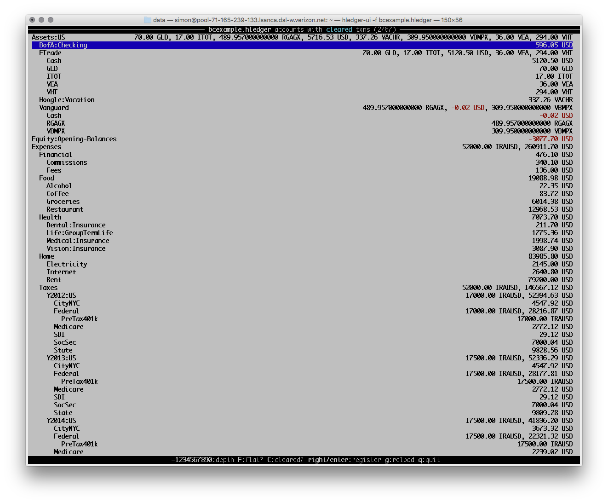
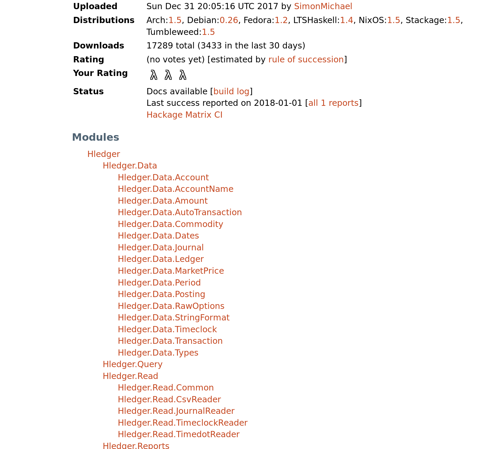

---
title: home
...

 <!-- main row -->
<!-- 
 <\!-- main column -\-> -->

 <!-- main column -->

 <!-- top-right area -->

<!-- get started box -->

<h2 class="panel-title">Get started</h2>

**[Install](download.html)**,
read the
**[release notes](release-notes.html)**,
**[tutorial](step-by-step.html)**,
or **[manual](manual.html)**,
<!-- or **[blog posts](more-docs.html#blog-posts-articles)**, -->
try the **[web UI](http://demo.hledger.org)**,
introduce yourself and tell us what's good/bad..

|
|---------------------------|-------------------------------------------------------------------------
| IRC                       | [#hledger](http://irc.hledger.org) <!-- (see also [#ledger](http://webchat.freenode.net?channels=ledger&randomnick=1)) -->
| Mail list&nbsp;&nbsp;     | via [google](http://list.hledger.org) or [gmane](http://news.gmane.org/gmane.comp.finance.ledger.hledger)
| Twitter                   | [#ledgercli](https://twitter.com/search?q=%23ledgercli&src=typd&f=realtime), <a href="https://twitter.com/ledgertips">@LedgerTips</a>
| Github                    | [code](http://github.com/simonmichael/hledger), [bugs](http://bugs.hledger.org), [issues](http://issues.hledger.org)

<!-- | More...&nbsp;&nbsp;       | [quick links](http://hledger.org/developer-guide.html#quick-links) -->

<!-- | web UI demo             | [demo.hledger.org](http://demo.hledger.org) | -->
<!-- [web ui demo](http://demo.hledger.org/register?q=inacct%3Aassets%3Abank%3Achecking+sym%3A\%24) -->

 <!-- end of get started box -->

 <!-- end of top-right area -->

 <!-- second top-right area -->
<!-- donate buttons -->

 <!-- Has hledger saved you or your employer money, time or peace of mind ?
<!-- Would you like to support our mission ? (and what should it be ?)
<!-- Donations: -->
 &nbsp;\
<!-- 

 &nbsp; -->
 &nbsp;
 &nbsp;
<!-- Also testimonials, examples, blogging, packaging, and patches. -->

 <!-- end of donate buttons -->

 <!-- end of second top-right area -->

<!-- main content -->

<h1 style="font-size:6em;">hledger</h1>

<h2 style="margin-top:0; margin-bottom:.5em;">
<!-- Making accounting fun for techies. -->
Simple, precise, future-proof accounting for techies.
</h2>

 <!-- large text -->

hledger is a lightweight accounting program for tracking money, time, or
other commodities, on unix, mac and windows. With simple yet powerful
functionality accessed from command line, terminal or web browser, it is a
reliable, cross-platform alternative to Quicken, GnuCash, spreadsheets etc.

**Step 1:** Record your transactions in a plain text file (using any text editor,
hledger's add command, the web interface, CSV or OFX import, custom scripts..)

**Step 2:** Ask hledger about your accounts, currencies, balances,
monthly averages, market values and more.

You can start out very simple, and get more sophisticated as you learn
more about double-entry accounting.  You'll feel closer to your
finances, and accounting becomes fun.  [Try it!](step-by-step.html)

<!-- I use it for: -->

<!-- - tracking spending and income -->
<!-- - seeing time reports by day/week/month/project -->
<!-- - getting accurate numbers for client billing and tax filing -->
<!-- - tracking invoices -->
<!-- - building financial and time clarity and serenity -->

### Free&nbsp;software

hledger is Free software released under GNU GPLv3+, which helps ensure
its longevity.  It has been developed by
[Simon Michael](http://joyful.com) and contributors since 2007.

### inspired by Ledger

hledger is a Haskell reimplementation of the excellent [Ledger](faq.html#hledger-and-ledger).
It remains substantially compatible with Ledger - if you wish you can keep your data compatible with both -
and it is part of the enthusiastic and growing *ledger community.
Read more about the differences in the [FAQ](faq.html#hledger-and-ledger).

### a command-line tool, that respects your data

hledger is first a command-line tool. 
Your data lives in a plain text journal file which you can edit
any way you wish; hledger reads that file and produces reports of
various kinds, without changing your data. (It can help you add new
transactions, but does not change existing ones.)

### a console UI

hledger also provides a curses-style [console&nbsp;interface](manual#ui)
that lets you review account balances and transactions with fewer
keystrokes and less effort.

### a web UI

hledger comes with a built-in web server providing a
[web&nbsp;interface](manual.html#web)
([demo](http://demo.hledger.org)), for assisted data entry and point
and click reporting. The web and command-line/curses interfaces can be used
simultaneously.

### a Haskell application and library

hledger is written in Haskell, a modern, highly-regarded
programming language which contributes to hledger's robustness,
performance and long-term maintainability.  Most functionality is
exposed as reusable Haskell
[libraries](http://hackage.haskell.org/package/hledger-lib), making it
easy to write your own hledger-compatible
[scripts](more-docs.html#scripting-examples), [add-ons](manual.html#add-ons) and
applications.
&nbsp;&nbsp;

<!-- 
 -->
<!-- ### comfortable for techies, usable by all -->

<!-- hledger aims to be useful to both computer experts and regular folks. -->
<!-- Currently it is a bit more suited to power users, who appreciate the -->
<!-- power of text files, revision control, scriptability and double entry -->
<!-- accounting. The web interface helps make it accessible to GUI-only -->
<!-- folk as well. -->
<!-- 
 -->

### focussed on serving users

hledger strives to be usable, practical and to provide real-world value.
Intuitive features, bug-free operation and complete, accurate documentation are top goals.
Currently it is particularly suited to techies, ie users who appreciate the
power of text files, revision control, scriptability and double entry
accounting. 

I've been using hledger daily and improving it since 2007.
I needed a tool like this badly, and I want to keep it growing and
helping others to transform their financial lives.
If you feel the same way, join us!

 <!-- end of large text -->

<!-- end of main content -->

<!-- twitter widget -->
<!-- 
 -->

### Latest tweets about hledger and Ledger:

 <!-- end of twitter widget -->

 <!-- end of main row -->
